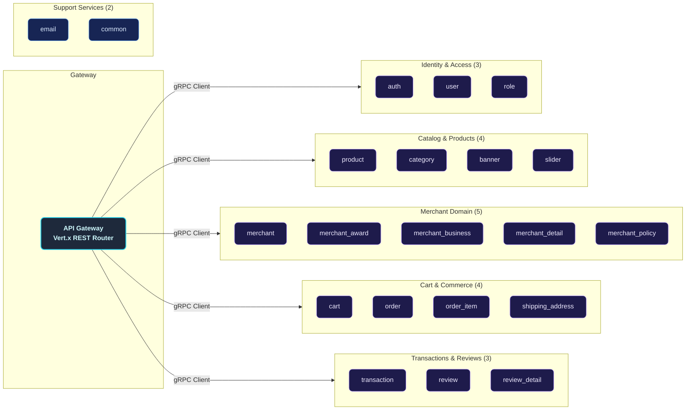
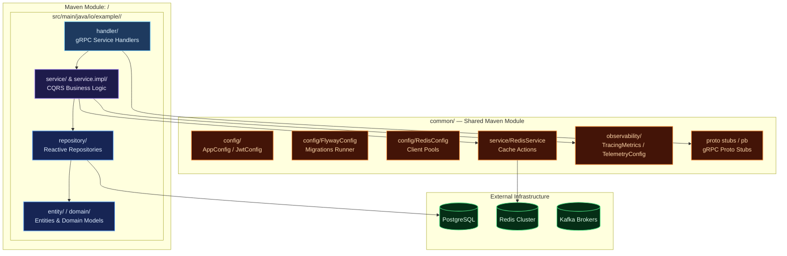
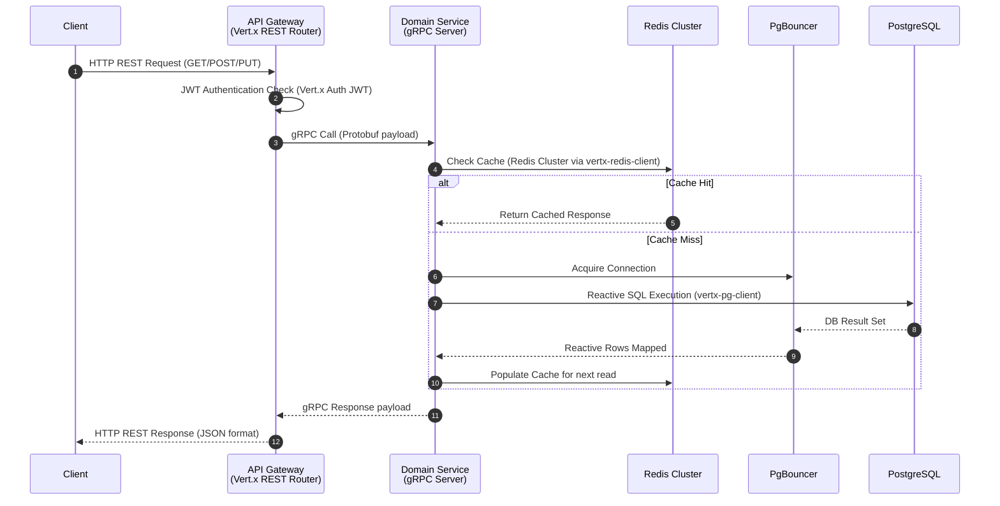
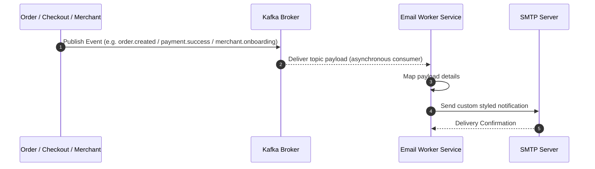
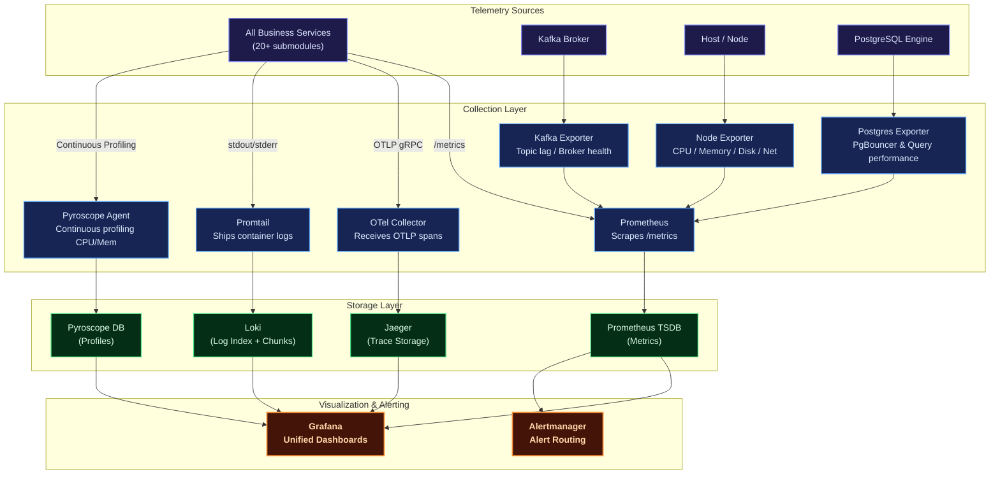

# Distributed Modular Monolith — E-Commerce Platform (Java Vert.x)

A production-grade, highly resilient, and fully observable **modular-monolith e-commerce backend** built in **Java 21** using the **Eclipse Vert.x** reactive toolkit (v4.5.24). Designed around domain-driven service boundaries following Clean Architecture and CQRS principles, it retains the operational and deployment simplicity of a single deployment unit while maintaining logical isolation typical of microservices.

Each e-commerce, merchant, catalog, and identity business domain — Users, Roles, Catalog, Products, Banners, Sliders, Carts, Orders, Shipping, Merchants, Transactions, Reviews, and more — lives in its own self-contained Maven module. These modules communicate synchronously via high-performance **gRPC** protocols and asynchronously using **Apache Kafka** event propagation, exposing a unified reactive entry point through a **REST API Gateway** powered by Eclipse Vert.x Web Router and Vert.x gRPC clients.

The platform is fortified with a **comprehensive observability suite** (Prometheus, Grafana, Loki, Jaeger, OpenTelemetry, Pyroscope), robust connection pooling via **PgBouncer**, **distributed Redis Cluster caching** with custom telemetry for each service, and Kubernetes configurations ready for production auto-scaling.

---

## Key Features

| Domain | Capabilities |
| :--- | :--- |
| **Auth & Users** | Secure registration, multi-factor login, stateless JWT access/refresh token lifecycle, password reset workflows, OTP email verification, and `/me` profile REST endpoint. |
| **Roles & RBAC** | Custom permission configuration, granular access control matrices, and sub-second permission evaluation cached via Redis. |
| **Catalog & Products** | Full CRUD for products & categories, promo banners, and home slider carousels. |
| **Cart & Commerce** | Add-to-cart, checkout workflows, order lifecycle management, order-item decomposition, and shipping address details. |
| **Merchants** | Fully featured merchant onboarding, profile details management, business data registration, policies, and merchant awards. |
| **Transactions** | Centralized financial audit ledger collecting transaction and payment events across the system, global search filters, and status tracking. |
| **Reviews** | Product ratings & detailed review submissions post-purchase. |
| **Email Worker** | Kafka-driven asynchronous worker dispatching critical notification emails (OTPs, login alerts, merchant onboarding notices, and transaction invoices) via SMTP. |
| **Observability** | Multi-dimensional metrics (Prometheus + Grafana), log aggregation (Loki + Logback), end-to-end distributed tracing (Jaeger + OpenTelemetry), and resource monitors (Node, Kafka, Postgres Exporters). |
| **Deployment** | Local orchestration using Docker Compose (featuring a 6-node Redis Cluster and PgBouncer), and auto-scaling Kubernetes manifests configured with Horizontal Pod Autoscalers (HPA). |

---

## Architecture Overview

The platform implements a **Distributed Modular Monolith** architecture. Each business service is logically decoupled and self-contained inside its own Maven submodule, possessing its own independent gRPC boundary. A **Vert.x Web REST API Gateway** acts as the unified edge router, transforming client HTTP REST requests into fast gRPC downstream communications via Vert.x gRPC clients.

### Core Architecture Principles

- **Domain-Driven Boundary Isolation**: Every service owns its database access (via `vertx-pg-client`), caching layers, and service logic, strictly forbidding cross-boundary database sharing.
- **Clean Architecture & CQRS**: Separation of concerns using `Handler (gRPC) → Service (Command/Query) → Repository (Command/Query)` layers ensures business logic remains clean, performant, and framework-agnostic.
- **Reactive Execution**: Powered entirely by the non-blocking Eclipse Vert.x event loop, using Vert.x `Future`s for clean, high-performance asynchronous flows.
- **PgBouncer Pooling**: Employs PgBouncer connection pooling to avoid PostgreSQL socket exhaustion across the multiple concurrent modular services.
- **Event-Driven Resilience**: Apache Kafka client (`vertx-kafka-client`) decouples notification events (like order completions, invoices, onboarding notices), ensuring side effects remain completely non-blocking.
- **OTel Telemetry Integration**: Standardized OpenTelemetry middleware injects trace IDs across gRPC boundaries, allowing seamless trace propagation from the client REST gateway down to postgres operations.

```mermaid
graph TB
    classDef client fill:#0f172a,stroke:#38bdf8,color:#e0f2fe,stroke-width:2px,font-weight:bold
    classDef gateway fill:#1e293b,stroke:#22d3ee,color:#cffafe,stroke-width:2px,font-weight:bold
    classDef domain fill:#1e1b4b,stroke:#818cf8,color:#e0e7ff,stroke-width:1.5px
    classDef infra fill:#172554,stroke:#60a5fa,color:#dbeafe,stroke-width:1.5px
    classDef obs fill:#052e16,stroke:#4ade80,color:#dcfce7,stroke-width:1.5px
    classDef event fill:#431407,stroke:#fb923c,color:#fed7aa,stroke-width:1.5px

    Client["Client Applications<br/>(Web / Mobile / API)"]:::client

    subgraph APIGateway["API Gateway — NGINX + Vert.x REST Gateway"]
        direction LR
        REST["REST API Route Handler<br/>Port :5000"]:::gateway
        AuthMW["JWT Auth & Role<br/>Middleware"]:::gateway
    end

    Client -->|HTTP REST| APIGateway

    subgraph BusinessServices["Business Domain Services (Java Vert.x)"]
        direction TB

        subgraph IdentityDomain["Identity & Access"]
            AUTH["Auth Service<br/>JWT & BCrypt Server"]:::domain
            USER["User Service<br/>Profile Management"]:::domain
            ROLE["Role Service<br/>RBAC & Permissions"]:::domain
        end

        subgraph CatalogDomain["Catalog & Products"]
            PRODUCT["Product Service<br/>Items & Inventory"]:::domain
            CATEGORY["Category Service<br/>Product Taxonomies"]:::domain
            BANNER["Banner Service<br/>Promo Showcases"]:::domain
            SLIDER["Slider Service<br/>Home Carousels"]:::domain
        end

        subgraph MerchantDomain["Merchant Suite"]
            MERCH["Merchant Service<br/>Onboarding & Profiling"]:::domain
            MERCH_AW["Merchant Award Service<br/>Badges & Rewards"]:::domain
            MERCH_BIZ["Merchant Business Service<br/>Registration Info"]:::domain
            MERCH_DTL["Merchant Detail Service<br/>Profile Settings"]:::domain
            MERCH_POL["Merchant Policy Service<br/>Merchant Rules"]:::domain
        end

        subgraph CommerceDomain["Cart & Commerce"]
            CART["Cart Service<br/>Active Shopping Carts"]:::domain
            ORDER["Order Service<br/>Order Management"]:::domain
            ORDER_ITEM["OrderItem Service<br/>Order Line Items"]:::domain
            SHIPPING["Shipping Address Service<br/>Delivery Logistics"]:::domain
        end

        subgraph TransactionDomain["Transactions & Reviews"]
            TXN["Transaction Service<br/>Central Ledger & Payments"]:::domain
            REVIEW["Review Service<br/>Ratings & Feedback"]:::domain
            REVIEW_DTL["Review Detail Service<br/>Detailed Customer Reviews"]:::domain
        end
    end

    REST -->|"Vert.x gRPC Client"| AUTH
    REST -->|"Vert.x gRPC Client"| USER
    REST -->|"Vert.x gRPC Client"| ROLE
    REST -->|"Vert.x gRPC Client"| PRODUCT
    REST -->|"Vert.x gRPC Client"| CATEGORY
    REST -->|"Vert.x gRPC Client"| BANNER
    REST -->|"Vert.x gRPC Client"| SLIDER
    REST -->|"Vert.x gRPC Client"| MERCH
    REST -->|"Vert.x gRPC Client"| MERCH_AW
    REST -->|"Vert.x gRPC Client"| MERCH_BIZ
    REST -->|"Vert.x gRPC Client"| MERCH_DTL
    REST -->|"Vert.x gRPC Client"| MERCH_POL
    REST -->|"Vert.x gRPC Client"| CART
    REST -->|"Vert.x gRPC Client"| ORDER
    REST -->|"Vert.x gRPC Client"| ORDER_ITEM
    REST -->|"Vert.x gRPC Client"| SHIPPING
    REST -->|"Vert.x gRPC Client"| TXN
    REST -->|"Vert.x gRPC Client"| REVIEW
    REST -->|"Vert.x gRPC Client"| REVIEW_DTL

    subgraph Infrastructure["Infrastructure Layer"]
        direction LR
        PGBOUNCER["PgBouncer<br/>Connection Pooler :6432"]:::infra
        PG[("PostgreSQL<br/>ECOMMERCE DB")]:::infra
        REDIS[("Redis Cluster<br/>6-Node Distributed Cache")]:::infra
        KAFKA[("Kafka Broker<br/>Event Bus")]:::infra
    end

    AUTH -->|"vertx-pg-client"| PGBOUNCER
    USER -->|"vertx-pg-client"| PGBOUNCER
    ROLE -->|"vertx-pg-client"| PGBOUNCER
    PRODUCT -->|"vertx-pg-client"| PGBOUNCER
    CATEGORY -->|"vertx-pg-client"| PGBOUNCER
    BANNER -->|"vertx-pg-client"| PGBOUNCER
    SLIDER -->|"vertx-pg-client"| PGBOUNCER
    MERCH -->|"vertx-pg-client"| PGBOUNCER
    MERCH_AW -->|"vertx-pg-client"| PGBOUNCER
    MERCH_BIZ -->|"vertx-pg-client"| PGBOUNCER
    MERCH_DTL -->|"vertx-pg-client"| PGBOUNCER
    MERCH_POL -->|"vertx-pg-client"| PGBOUNCER
    CART -->|"vertx-pg-client"| PGBOUNCER
    ORDER -->|"vertx-pg-client"| PGBOUNCER
    ORDER_ITEM -->|"vertx-pg-client"| PGBOUNCER
    SHIPPING -->|"vertx-pg-client"| PGBOUNCER
    TXN -->|"vertx-pg-client"| PGBOUNCER
    REVIEW -->|"vertx-pg-client"| PGBOUNCER
    REVIEW_DTL -->|"vertx-pg-client"| PGBOUNCER

    PGBOUNCER --> PG

    AUTH -->|"vertx-redis-client"| REDIS
    USER -->|"vertx-redis-client"| REDIS
    ROLE -->|"vertx-redis-client"| REDIS
    PRODUCT -->|"vertx-redis-client"| REDIS
    CATEGORY -->|"vertx-redis-client"| REDIS
    BANNER -->|"vertx-redis-client"| REDIS
    SLIDER -->|"vertx-redis-client"| REDIS
    MERCH -->|"vertx-redis-client"| REDIS
    CART -->|"vertx-redis-client"| REDIS
    REST -->|"vertx-redis-client"| REDIS

    subgraph EventConsumers["Event-Driven Consumers"]
        EMAIL["Email Service<br/>SMTP Notification Worker"]:::event
    end

    KAFKA -->|"Consume Events"| EMAIL

    subgraph Observability["Observability Stack"]
        direction LR
        PROM["Prometheus<br/>Metrics Engine"]:::obs
        LOKI["Loki<br/>Log Aggregator"]:::obs
        JAEGER["Jaeger<br/>Distributed Traces"]:::obs
        GRAFANA["Grafana<br/>Unified Dashboards"]:::obs
        OTEL["OTel Collector<br/>Telemetry Pipeline"]:::obs
        PROMTAIL["Promtail<br/>Log Shipper"]:::obs
        NODEX["Node Exporter<br/>System Metrics"]:::obs
        KAFKAX["Kafka Exporter<br/>Broker Metrics"]:::obs
        PGX["Postgres Exporter<br/>DB Performance"]:::obs
        PYRO["Pyroscope<br/>Continuous Profiler"]:::obs
    end

    AUTH -->|gRPC| USER
    AUTH -->|gRPC| ROLE
    MERCH -->|gRPC| USER
    CART -->|gRPC| USER
    ORDER -->|gRPC| USER
    ORDER -->|gRPC| SHIPPING
    ORDER -->|gRPC| CART
    ORDER -->|gRPC| TXN
    REVIEW -->|gRPC| USER
    REVIEW -->|gRPC| PRODUCT

    AUTH -.->|"Publish Verification Event"| KAFKA
    ORDER -.->|"Publish Order Event"| KAFKA
    TXN -.->|"Publish Transaction Event"| KAFKA
    MERCH -.->|"Publish Merchant Event"| KAFKA

    AUTH -.->|"/metrics"| PROM
    USER -.->|"/metrics"| PROM
    ROLE -.->|"/metrics"| PROM
    PRODUCT -.->|"/metrics"| PROM
    CATEGORY -.->|"/metrics"| PROM
    BANNER -.->|"/metrics"| PROM
    SLIDER -.->|"/metrics"| PROM
    MERCH -.->|"/metrics"| PROM
    CART -.->|"/metrics"| PROM
    ORDER -.->|"/metrics"| PROM
    TXN -.->|"/metrics"| PROM
    REST -.->|"/metrics"| PROM

    AUTH -.->|"OTLP Spans"| OTEL
    USER -.->|"OTLP Spans"| OTEL
    ROLE -.->|"OTLP Spans"| OTEL
    PRODUCT -.->|"OTLP Spans"| OTEL
    CATEGORY -.->|"OTLP Spans"| OTEL
    MERCH -.->|"OTLP Spans"| OTEL
    CART -.->|"OTLP Spans"| OTEL
    ORDER -.->|"OTLP Spans"| OTEL
    TXN -.->|"OTLP Spans"| OTEL
    REST -.->|"OTLP Spans"| OTEL

    OTEL -.-> JAEGER
    PROMTAIL -.-> LOKI
    NODEX -.-> PROM
    KAFKAX -.-> PROM
    PGX -.-> PROM
    PROM -.-> GRAFANA
    LOKI -.-> GRAFANA
    JAEGER -.-> GRAFANA
    KAFKA -.-> KAFKAX
    PG -.-> PGX
    AUTH -.->|Profile| PYRO
    USER -.->|Profile| PYRO
    ORDER -.->|Profile| PYRO
    TXN -.->|Profile| PYRO
```



---

## Service Catalog

The modular architecture consists of **22 logical submodules** plus supporting libraries and infrastructure:



---

## Internal Service Architecture

Every logical business service is mapped as a decoupled submodule following structured clean architecture rules.



---

## Data & Event Flow

### Synchronous Flow (REST Proxy & Cache Read-Through)

All external client API requests go through the REST endpoints defined in the Vert.x API Gateway Router. The API Gateway validates the JWT/API Key, connects with the correct downstream gRPC modular server, checks the Redis Cluster cache, and fetches PostgreSQL through PgBouncer if a cache miss occurs.



### Asynchronous Flow (Kafka Notification Event pipeline)

High-performance e-commerce actions (like successful order checkouts or merchant onboarding approvals) trigger background notification events published directly to Apache Kafka brokers. The isolated Email service listens to Kafka topics, maps the events, and sends SMTP notifications.



---

## Observability Architecture



| Pillar | Tool | Purpose |
| :--- | :--- | :--- |
| **Metrics** | Prometheus + Grafana | Core metrics tracking (CPU, memory, request error rates, gRPC latencies, DB connection states). |
| **Logging** | Loki + Logback | Centralized structured JSON logger for indexing logs by service, queryable via LogQL. |
| **Tracing** | OpenTelemetry + Jaeger | Distributed system tracing across API gateway and internal gRPC services. |
| **Profiling** | Pyroscope | Continuous CPU and Memory profiling across modular services to diagnose latency bottlenecks. |
| **Alerting** | Alertmanager | Automated notification system triggered during latency hikes or service disconnects. |

---

## Chaos Engineering Platform

The E-Commerce platform features a built-in reactive Chaos Engineering engine to continuously test system resilience under failure conditions (database spikes, SQL lock deadlocks, slow HTTP endpoints, CPU stress, and memory leaks). 

The chaos engine is managed by [ChaosManager](./common/src/main/java/io/example/common/chaos/ChaosManager.java) which dynamically watches [chaos.yaml](./chaos.yaml) for modifications:
- **Dynamic Hot-Reloading**: Checks `chaos.yaml` for changes every 5 seconds. Adjusting values or toggling policies will update the running system instantly without requiring a service restart.

For details on architecture, injection mechanisms, and configuration examples, read the [Chaos Engineering Documentation](./chaos-engineering.md).

---

## Deployment Architectures

### Docker Compose (Local Development)

The Docker Compose configuration provisions a 6-node Redis Cluster along with databases, event brokers, continuous profilers, and reactive service containers to replicate a microservices environment.

```mermaid
flowchart TB
    classDef gateway fill:#1e293b,stroke:#22d3ee,color:#cffafe,stroke-width:2px,font-weight:bold
    classDef core fill:#1e1b4b,stroke:#a78bfa,color:#ede9fe,stroke-width:1.5px
    classDef infra fill:#172554,stroke:#60a5fa,color:#dbeafe,stroke-width:1.5px
    classDef obs fill:#052e16,stroke:#4ade80,color:#dcfce7,stroke-width:1.5px
    classDef event fill:#431407,stroke:#fb923c,color:#fed7aa,stroke-width:1.5px

    subgraph DockerCompose["docker-compose.yml — Local Environment"]

        subgraph Gateway["API Gateway"]
            NGINX["NGINX Proxy :80"]:::gateway
            APIGW["API Gateway Container<br/>Vert.x REST Gateway :5000"]:::gateway
        end

        subgraph Services["Core Service Containers"]
            subgraph Identity["Identity & Access"]
                AUTH["auth-service"]:::core
                USER["user-service"]:::core
                ROLE["role-service"]:::core
            end

            subgraph CatalogSuite["Catalog & Products"]
                PRODUCT["product-service"]:::core
                CATEGORY["category-service"]:::core
                BANNER["banner-service"]:::core
                SLIDER["slider-service"]:::core
            end

            subgraph CommerceSuite["Cart & Commerce"]
                CART["cart-service"]:::core
                ORDER["order-service"]:::core
                ORDER_ITEM["order_item-service"]:::core
                SHIPPING["shipping_address-service"]:::core
            end

            subgraph MerchantSuite["Merchant Domain"]
                MERCH["merchant-service"]:::core
                MERCH_AW["merchant_award-service"]:::core
                MERCH_BIZ["merchant_business-service"]:::core
                MERCH_DTL["merchant_detail-service"]:::core
                MERCH_POL["merchant_policy-service"]:::core
            end

            subgraph AuditsSuite["Transactions & Reviews"]
                TXN["transaction-service"]:::core
                REVIEW["review-service"]:::core
                REVIEW_DTL["review_detail-service"]:::core
            end
        end

        subgraph Infra["Infrastructure Suite"]
            PG[("PostgreSQL :5432")]:::infra
            PGB[("PgBouncer :6432")]:::infra
            REDIS_CLUSTER[("Redis Cluster :6379-6384<br/>6 Nodes Enabled")]:::infra
            KAFKA[("Kafka Broker :9092")]:::infra
        end

        subgraph Obs["Observability Stack"]
            PROM["Prometheus :9090"]:::obs
            GRAFANA["Grafana :3000"]:::obs
            LOKI["Loki :3100"]:::obs
            JAEGER["Jaeger :16686"]:::obs
            OTEL["OTel Collector :4317"]:::obs
            NODEX["Node Exporter"]:::obs
            KAFKAX["Kafka Exporter"]:::obs
            PGX["Postgres Exporter"]:::obs
            PROMTAIL["Promtail Log Shipper"]:::obs
            PYRO["Pyroscope :4040"]:::obs
        end

        subgraph Events["Event Consumers"]
            EMAIL["Email Worker"]:::event
        end
    end

    NGINX --> APIGW
    
    APIGW -->|gRPC| AUTH
    APIGW -->|gRPC| USER
    APIGW -->|gRPC| ROLE
    APIGW -->|gRPC| PRODUCT
    APIGW -->|gRPC| CATEGORY
    APIGW -->|gRPC| BANNER
    APIGW -->|gRPC| SLIDER
    APIGW -->|gRPC| MERCH
    APIGW -->|gRPC| MERCH_AW
    APIGW -->|gRPC| MERCH_BIZ
    APIGW -->|gRPC| MERCH_DTL
    APIGW -->|gRPC| MERCH_POL
    APIGW -->|gRPC| CART
    APIGW -->|gRPC| ORDER
    APIGW -->|gRPC| ORDER_ITEM
    APIGW -->|gRPC| SHIPPING
    APIGW -->|gRPC| TXN
    APIGW -->|gRPC| REVIEW
    APIGW -->|gRPC| REVIEW_DTL

    AUTH -->|SQL| PGB
    USER -->|SQL| PGB
    ROLE -->|SQL| PGB
    PRODUCT -->|SQL| PGB
    CATEGORY -->|SQL| PGB
    BANNER -->|SQL| PGB
    SLIDER -->|SQL| PGB
    MERCH -->|SQL| PGB
    MERCH_AW -->|SQL| PGB
    MERCH_BIZ -->|SQL| PGB
    MERCH_DTL -->|SQL| PGB
    MERCH_POL -->|SQL| PGB
    CART -->|SQL| PGB
    ORDER -->|SQL| PGB
    ORDER_ITEM -->|SQL| PGB
    SHIPPING -->|SQL| PGB
    TXN -->|SQL| PGB
    REVIEW -->|SQL| PGB
    REVIEW_DTL -->|SQL| PGB

    PGB --> PG

    AUTH -->|Cache| REDIS_CLUSTER
    USER -->|Cache| REDIS_CLUSTER
    ROLE -->|Cache| REDIS_CLUSTER
    PRODUCT -->|Cache| REDIS_CLUSTER
    CATEGORY -->|Cache| REDIS_CLUSTER
    BANNER -->|Cache| REDIS_CLUSTER
    SLIDER -->|Cache| REDIS_CLUSTER
    MERCH -->|Cache| REDIS_CLUSTER
    CART -->|Cache| REDIS_CLUSTER
    APIGW --> REDIS_CLUSTER

    AUTH -->|gRPC| USER
    AUTH -->|gRPC| ROLE
    MERCH -->|gRPC| USER
    CART -->|gRPC| USER
    ORDER -->|gRPC| USER
    ORDER -->|gRPC| SHIPPING
    ORDER -->|gRPC| CART
    ORDER -->|gRPC| TXN
    REVIEW -->|gRPC| USER
    REVIEW -->|gRPC| PRODUCT

    AUTH -.->|"Publish Events"| KAFKA
    ORDER -.->|"Publish Events"| KAFKA
    TXN -.->|"Publish Events"| KAFKA
    MERCH -.->|"Publish Events"| KAFKA

    KAFKA --> EMAIL

    AUTH -.->|"Metrics"| PROM
    USER -.->|"Metrics"| PROM
    ROLE -.->|"Metrics"| PROM
    PRODUCT -.->|"Metrics"| PROM
    CATEGORY -.->|"Metrics"| PROM
    BANNER -.->|"Metrics"| PROM
    SLIDER -.->|"Metrics"| PROM
    MERCH -.->|"Metrics"| PROM
    CART -.->|"Metrics"| PROM
    ORDER -.->|"Metrics"| PROM
    TXN -.->|"Metrics"| PROM
    REST -.->|"Metrics"| PROM

    AUTH -.->|"Traces"| OTEL
    USER -.->|"Traces"| OTEL
    ROLE -.->|"Traces"| OTEL
    PRODUCT -.->|"Traces"| OTEL
    CATEGORY -.->|"Traces"| OTEL
    MERCH -.->|"Traces"| OTEL
    CART -.->|"Traces"| OTEL
    ORDER -.->|"Traces"| OTEL
    TXN -.->|"Traces"| OTEL
    REST -.->|"Traces"| OTEL

    AUTH -.->|"Profile"| PYRO
    USER -.->|"Profile"| PYRO
    ORDER -.->|"Profile"| PYRO
    TXN -.->|"Profile"| PYRO

    OTEL -.-> JAEGER
    PROMTAIL -.-> LOKI
    PROM -.-> GRAFANA
    LOKI -.-> GRAFANA
    PYRO -.-> GRAFANA

    KAFKA -.-> KAFKAX
    PG -.-> PGX
    KAFKAX -.-> PROM
    PGX -.-> PROM
    NODEX -.-> PROM
```



---

### Kubernetes (Production Clustering)

The production-grade Kubernetes architecture is designed for high availability, fault tolerance, and seamless horizontal scaling. All manifests are defined inside the custom `ecommerce` namespace, route edge traffic using NGINX pods acting as a LoadBalancer, and manage service scalability using individual HPAs.

```mermaid
flowchart TB
    classDef client fill:#0f172a,stroke:#38bdf8,color:#e0f2fe,stroke-width:2px,font-weight:bold
    classDef ingress fill:#0f172a,stroke:#06b6d4,color:#e0f7fa,stroke-width:2px,font-weight:bold
    classDef k8sSvc fill:#1e293b,stroke:#22d3ee,color:#cffafe,stroke-width:2px,font-weight:bold
    classDef pod fill:#1e1b4b,stroke:#a78bfa,color:#ede9fe,stroke-width:1.5px
    classDef stateful fill:#172554,stroke:#60a5fa,color:#dbeafe,stroke-width:1.5px
    classDef hpa fill:#064e3b,stroke:#34d399,color:#ecfdf5,stroke-width:1px,stroke-dasharray: 5 5
    classDef obs fill:#052e16,stroke:#4ade80,color:#dcfce7,stroke-width:1.5px

    Client["Client Applications<br/>(HTTPS Requests)"]:::client

    subgraph K8sCluster["Kubernetes Cluster — Namespace: ecommerce"]
        direction TB

        subgraph IngressLayer["Edge Reverse Proxy (NGINX)"]
            NGINX_SVC["nginx-service<br/>(LoadBalancer :80)"]:::k8sSvc
            NGINX_POD["nginx-pods"]:::pod
        end

        subgraph GatewayServices["REST API Gateway (Scalable Deployment)"]
            APIGW_SVC["apigateway-service<br/>(ClusterIP :5000)"]:::k8sSvc
            APIGW_PODS["apigateway-pods"]:::pod
            APIGW_HPA["apigateway-hpa"]:::hpa
        end

        subgraph DomainServices["Internal gRPC Microservices"]
            direction TB
            
            subgraph IdentityZone["Identity Suite"]
                AUTH_POD["auth-pods"]:::pod
                USER_POD["user-pods"]:::pod
                ROLE_POD["role-pods"]:::pod
                AUTH_SVC["auth-service (gRPC)"]:::k8sSvc
                USER_SVC["user-service (gRPC)"]:::k8sSvc
                ROLE_SVC["role-service (gRPC)"]:::k8sSvc
            end

            subgraph CatalogZone["Catalog & Products"]
                PROD_POD["product-pods"]:::pod
                CAT_POD["category-pods"]:::pod
                BANNER_POD["banner-pods"]:::pod
                SLIDER_POD["slider-pods"]:::pod
                PROD_SVC["product-service (gRPC)"]:::k8sSvc
                CAT_SVC["category-service (gRPC)"]:::k8sSvc
                BANNER_SVC["banner-service (gRPC)"]:::k8sSvc
                SLIDER_SVC["slider-service (gRPC)"]:::k8sSvc
            end

            subgraph MerchantZone["Merchant Suite"]
                MERCH_POD["merchant-pods"]:::pod
                MERCH_AW_POD["merchant-award-pods"]:::pod
                MERCH_BIZ_POD["merchant-business-pods"]:::pod
                MERCH_DTL_POD["merchant-detail-pods"]:::pod
                MERCH_POL_POD["merchant-policy-pods"]:::pod
                MERCH_SVC["merchant-service (gRPC)"]:::k8sSvc
                MERCH_AW_SVC["merchant-award-service (gRPC)"]:::k8sSvc
                MERCH_BIZ_SVC["merchant-business-service (gRPC)"]:::k8sSvc
                MERCH_DTL_SVC["merchant-detail-service (gRPC)"]:::k8sSvc
                MERCH_POL_SVC["merchant-policy-service (gRPC)"]:::k8sSvc
            end

            subgraph CommerceZone["Cart & Commerce"]
                CART_POD["cart-pods"]:::pod
                ORDER_POD["order-pods"]:::pod
                ORDER_ITEM_POD["order-item-pods"]:::pod
                SHIPPING_POD["shipping-address-pods"]:::pod
                CART_SVC["cart-service (gRPC)"]:::k8sSvc
                ORDER_SVC["order-service (gRPC)"]:::k8sSvc
                ORDER_ITEM_SVC["order-item-service (gRPC)"]:::k8sSvc
                SHIPPING_SVC["shipping-address-service (gRPC)"]:::k8sSvc
            end

            subgraph AuditsZone["Transactions & Reviews"]
                TX_POD["transaction-pods"]:::pod
                REV_POD["review-pods"]:::pod
                REV_DTL_POD["review-detail-pods"]:::pod
                TX_SVC["transaction-service (gRPC)"]:::k8sSvc
                REV_SVC["review-service (gRPC)"]:::k8sSvc
                REV_DTL_SVC["review-detail-service (gRPC)"]:::k8sSvc
            end
            
            PodsHPA["Domain Services HPAs<br/>(auth, order, product, merchant, etc.)"]:::hpa
        end

        subgraph DataObservability["Infrastructure & Databases"]
            PGB_SVC["pgbouncer-service<br/>(ClusterIP :6432)"]:::k8sSvc
            PGB_POD["pgbouncer-pods"]:::pod

            PG_SVC["postgres-service<br/>(ClusterIP :5432)"]:::k8sSvc
            PG_POD["postgres-pods"]:::pod
            
            REDIS_SVC["redis-cluster-service<br/>(ClusterIP :6379)"]:::k8sSvc
            REDIS_SET[("redis-cluster StatefulSet<br/>(6-Node Shards)")]:::stateful
            
            KAFKA_SVC["kafka-service<br/>(ClusterIP :9092)"]:::k8sSvc
            KAFKA_POD["kafka-pods"]:::pod
        end

        subgraph BackgroundWorkers["Event Consumers"]
            EMAIL_SVC["email-service<br/>(ClusterIP)"]:::k8sSvc
            EMAIL_PODS["email-pods"]:::pod
            EMAIL_HPA["email-hpa"]:::hpa
        end

        subgraph K8sObs["Observability Namespace Suite"]
            PROM_SVC["prometheus-service<br/>(ClusterIP :9090)"]:::k8sSvc
            PROM_POD["prometheus-pod"]:::pod

            OTEL_SVC["otel-collector-service<br/>(ClusterIP :4317)"]:::k8sSvc
            OTEL_POD["otel-collector-pod"]:::pod

            LOKI_SVC["loki-service<br/>(ClusterIP :3100)"]:::k8sSvc
            LOKI_POD["loki-pod"]:::pod

            JAEGER_SVC["jaeger-service<br/>(ClusterIP :16686)"]:::k8sSvc
            JAEGER_POD["jaeger-pod"]:::pod

            GRAFANA_SVC["grafana-service<br/>(ClusterIP :3000)"]:::k8sSvc
            GRAFANA_POD["grafana-pod"]:::pod

            ALERTMGR_SVC["alertmanager-service<br/>(ClusterIP :9093)"]:::k8sSvc
            ALERTMGR_POD["alertmanager-pod"]:::pod

            PROMTAIL["promtail-daemonset"]:::pod
            
            KAFKAX_SVC["kafka-exporter-service"]:::k8sSvc
            KAFKAX_POD["kafka-exporter-pod"]:::pod

            NODEX_SVC["node-exporter-service"]:::k8sSvc
            NODEX_POD["node-exporter-daemonset"]:::pod
            
            PYRO_SVC["pyroscope-service<br/>(ClusterIP :4040)"]:::k8sSvc
            PYRO_POD["pyroscope-pod"]:::pod
        end
    end

    Client -->|HTTPS :443| NGINX_SVC
    NGINX_SVC --> NGINX_POD
    NGINX_POD -->|Proxy Pass| APIGW_SVC
    APIGW_SVC --> APIGW_PODS
    APIGW_HPA -.->|Autoscales| APIGW_PODS

    APIGW_PODS -->|gRPC call| AUTH_SVC
    APIGW_PODS -->|gRPC call| USER_SVC
    APIGW_PODS -->|gRPC call| ROLE_SVC
    APIGW_PODS -->|gRPC call| PROD_SVC
    APIGW_PODS -->|gRPC call| CAT_SVC
    APIGW_PODS -->|gRPC call| BANNER_SVC
    APIGW_PODS -->|gRPC call| SLIDER_SVC
    APIGW_PODS -->|gRPC call| MERCH_SVC
    APIGW_PODS -->|gRPC call| MERCH_AW_SVC
    APIGW_PODS -->|gRPC call| MERCH_BIZ_SVC
    APIGW_PODS -->|gRPC call| MERCH_DTL_SVC
    APIGW_PODS -->|gRPC call| MERCH_POL_SVC
    APIGW_PODS -->|gRPC call| CART_SVC
    APIGW_PODS -->|gRPC call| ORDER_SVC
    APIGW_PODS -->|gRPC call| ORDER_ITEM_SVC
    APIGW_PODS -->|gRPC call| SHIPPING_SVC
    APIGW_PODS -->|gRPC call| TX_SVC
    APIGW_PODS -->|gRPC call| REV_SVC
    APIGW_PODS -->|gRPC call| REV_DTL_SVC
    
    AUTH_SVC --> AUTH_POD
    USER_SVC --> USER_POD
    ROLE_SVC --> ROLE_POD
    PROD_SVC --> PROD_POD
    CAT_SVC --> CAT_POD
    BANNER_SVC --> BANNER_POD
    SLIDER_SVC --> SLIDER_POD
    MERCH_SVC --> MERCH_POD
    MERCH_AW_SVC --> MERCH_AW_POD
    MERCH_BIZ_SVC --> MERCH_BIZ_POD
    MERCH_DTL_SVC --> MERCH_DTL_POD
    MERCH_POL_SVC --> MERCH_POL_POD
    CART_SVC --> CART_POD
    ORDER_SVC --> ORDER_POD
    ORDER_ITEM_SVC --> ORDER_ITEM_POD
    SHIPPING_SVC --> SHIPPING_POD
    TX_SVC --> TX_POD
    REV_SVC --> REV_POD
    REV_DTL_SVC --> REV_DTL_POD

    AUTH_POD -->|SQL| PGB_SVC
    USER_POD -->|SQL| PGB_SVC
    ROLE_POD -->|SQL| PGB_SVC
    PROD_POD -->|SQL| PGB_SVC
    CAT_POD -->|SQL| PGB_SVC
    BANNER_POD -->|SQL| PGB_SVC
    SLIDER_POD -->|SQL| PGB_SVC
    MERCH_POD -->|SQL| PGB_SVC
    MERCH_AW_POD -->|SQL| PGB_SVC
    MERCH_BIZ_POD -->|SQL| PGB_SVC
    MERCH_DTL_POD -->|SQL| PGB_SVC
    MERCH_POL_POD -->|SQL| PGB_SVC
    CART_POD -->|SQL| PGB_SVC
    ORDER_POD -->|SQL| PGB_SVC
    ORDER_ITEM_POD -->|SQL| PGB_SVC
    SHIPPING_POD -->|SQL| PGB_SVC
    TX_POD -->|SQL| PGB_SVC
    REV_POD -->|SQL| PGB_SVC
    REV_DTL_POD -->|SQL| PGB_SVC

    PGB_SVC --> PGB_POD
    PGB_POD -->|SQL| PG_SVC
    PG_SVC --> PG_POD

    AUTH_POD -->|Cache| REDIS_SVC
    USER_POD -->|Cache| REDIS_SVC
    ROLE_POD -->|Cache| REDIS_SVC
    PROD_POD -->|Cache| REDIS_SVC
    CAT_POD -->|Cache| REDIS_SVC
    BANNER_POD -->|Cache| REDIS_SVC
    SLIDER_POD -->|Cache| REDIS_SVC
    MERCH_POD -->|Cache| REDIS_SVC
    CART_POD -->|Cache| REDIS_SVC

    REDIS_SVC --> REDIS_SET

    AUTH_POD -->|gRPC| USER_SVC
    AUTH_POD -->|gRPC| ROLE_SVC
    MERCH_POD -->|gRPC| USER_SVC
    CART_POD -->|gRPC| USER_SVC
    ORDER_POD -->|gRPC| USER_SVC
    ORDER_POD -->|gRPC| SHIPPING_SVC
    ORDER_POD -->|gRPC| CART_SVC
    ORDER_POD -->|gRPC| TX_SVC
    REV_POD -->|gRPC| USER_SVC
    REV_POD -->|gRPC| PROD_SVC

    AUTH_POD -->|Events| KAFKA_SVC
    ORDER_POD -->|Events| KAFKA_SVC
    TX_POD -->|Events| KAFKA_SVC
    MERCH_POD -->|Events| KAFKA_SVC

    KAFKA_SVC --> KAFKA_POD
    KAFKA_POD -->|Message Stream| EMAIL_SVC
    EMAIL_SVC --> EMAIL_PODS
    EMAIL_HPA -.->|Autoscales| EMAIL_PODS

    PodsHPA -.->|Autoscales| AUTH_POD
    PodsHPA -.->|Autoscales| USER_POD
    PodsHPA -.->|Autoscales| ROLE_POD
    PodsHPA -.->|Autoscales| PROD_POD
    PodsHPA -.->|Autoscales| CAT_POD
    PodsHPA -.->|Autoscales| MERCH_POD
    PodsHPA -.->|Autoscales| CART_POD
    PodsHPA -.->|Autoscales| ORDER_POD
    PodsHPA -.->|Autoscales| TX_POD

    AUTH_POD -.->|"Metrics"| PROM_SVC
    USER_POD -.->|"Metrics"| PROM_SVC
    ROLE_POD -.->|"Metrics"| PROM_SVC
    PROD_POD -.->|"Metrics"| PROM_SVC
    CAT_POD -.->|"Metrics"| PROM_SVC
    MERCH_POD -.->|"Metrics"| PROM_SVC
    CART_POD -.->|"Metrics"| PROM_SVC
    ORDER_POD -.->|"Metrics"| PROM_SVC
    TX_POD -.->|"Metrics"| PROM_SVC
    APIGW_PODS -.->|"Metrics"| PROM_SVC

    AUTH_POD -.->|"Traces"| OTEL_SVC
    USER_POD -.->|"Traces"| OTEL_SVC
    ROLE_POD -.->|"Traces"| OTEL_SVC
    PROD_POD -.->|"Traces"| OTEL_SVC
    CAT_POD -.->|"Traces"| OTEL_SVC
    MERCH_POD -.->|"Traces"| OTEL_SVC
    CART_POD -.->|"Traces"| OTEL_SVC
    ORDER_POD -.->|"Traces"| OTEL_SVC
    TX_POD -.->|"Traces"| OTEL_SVC
    APIGW_PODS -.->|"Traces"| OTEL_SVC

    AUTH_POD -.->|"Profiling"| PYRO_SVC
    USER_POD -.->|"Profiling"| PYRO_SVC
    ORDER_POD -.->|"Profiling"| PYRO_SVC
    TX_POD -.->|"Profiling"| PYRO_SVC

    PROM_SVC --> PROM_POD
    OTEL_SVC --> OTEL_POD
    LOKI_SVC --> LOKI_POD
    JAEGER_SVC --> JAEGER_POD
    GRAFANA_SVC --> GRAFANA_POD
    ALERTMGR_SVC --> ALERTMGR_POD
    PYRO_SVC --> PYRO_POD

    OTEL_POD -.-> JAEGER_SVC
    PROMTAIL -.-> LOKI_SVC
    PROM_POD -.-> GRAFANA_SVC
    LOKI_POD -.-> GRAFANA_SVC
    PYRO_POD -.-> GRAFANA_SVC
    PROM_POD -.-> ALERTMGR_SVC

    KAFKA_SVC -.-> KAFKAX_SVC
    KAFKAX_SVC --> KAFKAX_POD
    KAFKAX_POD -.-> PROM_SVC
    NODEX_SVC --> NODEX_POD
    NODEX_POD -.-> PROM_SVC
```



### ArgoCD App-of-Apps GitOps Architecture

The platform follows GitOps best practices using ArgoCD for declarative continuous deployments. Replicating the App-of-Apps design pattern, a root Application (`ecommerce-root`) automatically manages and tracks the states of individual child Applications mapping to Kustomize bases.

Sync waves (`argocd.argoproj.io/sync-wave` annotations) are strictly defined to guarantee database migrations run and complete before domain applications start.

```mermaid
graph TD
    classDef root fill:#1e293b,stroke:#22d3ee,color:#cffafe,stroke-width:2.5px,font-weight:bold
    classDef proj fill:#0f172a,stroke:#38bdf8,color:#e0f2fe,stroke-width:2px
    classDef app fill:#1e1b4b,stroke:#a78bfa,color:#ede9fe,stroke-width:1.5px
    classDef wave fill:#1c1917,stroke:#f59e0b,color:#fef3c7,stroke-width:1.5px
    classDef base fill:#052e16,stroke:#34d399,color:#dcfce7,stroke-width:1.5px

    RootApp["ecommerce-root<br/>(ArgoCD Root Application)"]:::root
    AppProj["ecommerce<br/>(ArgoCD AppProject)"]:::proj

    RootApp -->|Creates & Tracks| AppProj
    RootApp -->|Deploys Application Manifests| AppIndex["Child Applications List<br/>(deployments/gitops/argocd/apps/)"]:::app

    subgraph SyncWaves["Ordered Deployment Sequencing (Sync Waves 1 - 6)"]
        direction TB

        subgraph Wave1["Wave 1: Namespace & Infrastructure"]
            W1_CM["common"]:::wave
            W1_PG["infra-postgres"]:::wave
            W1_RD["infra-redis"]:::wave
            W1_KF["infra-kafka"]:::wave
        end

        subgraph Wave2["Wave 2: Database Migration"]
            W2_MIG["db-migration"]:::wave
        end

        subgraph Wave3["Wave 3: Core Domain Services"]
            W3_AUTH["service-auth"]:::wave
            W3_USR["service-user"]:::wave
            W3_ROL["service-role"]:::wave
            W3_PROD["service-product"]:::wave
            W3_CAT["service-category"]:::wave
            W3_MER["service-merchant"]:::wave
            W3_ORD["service-order"]:::wave
            W3_CRT["service-cart"]:::wave
            W3_EML["service-email"]:::wave
            W3_OTH["other-domain-services"]:::wave
        end

        subgraph Wave4["Wave 4: Financial Movements"]
            W4_TXN["service-transaction"]:::wave
        end

        subgraph Wave5["Wave 5: Reverse Proxy Gateway"]
            W5_APIGW["apigateway"]:::wave
            W5_NGINX["nginx"]:::wave
        end

        subgraph Wave6["Wave 6: Observability Suite"]
            W6_OBS["service-observability"]:::wave
        end

        Wave1 -->|Triggers next wave| Wave2
        Wave2 -->|Triggers next wave| Wave3
        Wave3 -->|Triggers next wave| Wave4
        Wave4 -->|Triggers next wave| Wave5
        Wave5 -->|Triggers next wave| Wave6
    end

    AppIndex -->|Deploys| Wave1
    AppIndex -->|Deploys| Wave2
    AppIndex -->|Deploys| Wave3
    AppIndex -->|Deploys| Wave4
    AppIndex -->|Deploys| Wave5
    AppIndex -->|Deploys| Wave6

    subgraph K8sBases["Target: Kustomize Base Resources"]
        B_COMMON["deployments/kubernetes/base/common"]:::base
        B_PG["deployments/kubernetes/base/postgres"]:::base
        B_RD["deployments/kubernetes/base/redis"]:::base
        B_KF["deployments/kubernetes/base/kafka"]:::base
        B_MIG["deployments/kubernetes/base/db-migration"]:::base
        B_AUTH["deployments/kubernetes/base/auth"]:::base
        B_USR["deployments/kubernetes/base/user"]:::base
        B_ROL["deployments/kubernetes/base/role"]:::base
        B_PROD["deployments/kubernetes/base/product"]:::base
        B_CAT["deployments/kubernetes/base/category"]:::base
        B_MER["deployments/kubernetes/base/merchant"]:::base
        B_ORD["deployments/kubernetes/base/order"]:::base
        B_CRT["deployments/kubernetes/base/cart"]:::base
        B_EML["deployments/kubernetes/base/email"]:::base
        B_TXN["deployments/kubernetes/base/transaction"]:::base
        B_APIGW["deployments/kubernetes/base/apigateway"]:::base
        B_NGINX["deployments/kubernetes/base/nginx"]:::base
        B_OBS["deployments/kubernetes/base/observability"]:::base
    end

    W1_CM -->|Reconciles| B_COMMON
    W1_PG -->|Reconciles| B_PG
    W1_RD -->|Reconciles| B_RD
    W1_KF -->|Reconciles| B_KF
    W2_MIG -->|Reconciles| B_MIG
    W3_AUTH -->|Reconciles| B_AUTH
    W3_USR -->|Reconciles| B_USR
    W3_ROL -->|Reconciles| B_ROL
    W3_PROD -->|Reconciles| B_PROD
    W3_CAT -->|Reconciles| B_CAT
    W3_MER -->|Reconciles| B_MER
    W3_ORD -->|Reconciles| B_ORD
    W3_CRT -->|Reconciles| B_CRT
    W3_EML -->|Reconciles| B_EML
    W4_TXN -->|Reconciles| B_TXN
    W5_APIGW -->|Reconciles| B_APIGW
    W5_NGINX -->|Reconciles| B_NGINX
    W6_OBS -->|Reconciles| B_OBS
```



---

## Technology Stack

| Category | Selected Technologies | Purpose |
| :--- | :--- | :--- |
| **Language** | Java 21 (Eclipse Vert.x v4.5.24) | Reactive, non-blocking asynchronous toolkit. |
| **API Edge Gateway** | Vert.x Web Router | Reactive REST API Gateway router and reverse proxy destination. |
| **RPC Inter-service** | Vert.x gRPC Client & Server | Blazing fast, contract-first synchronous gRPC communication. |
| **Database** | PostgreSQL v17 | Safe ACID ledger persistent storage system. |
| **Database Client** | Vert.x pg-client (`vertx-pg-client`) | High-performance reactive database access without blocking threads. |
| **Database Gateway** | PgBouncer | Extreme-efficiency PostgreSQL socket connection pooler. |
| **DB Migrations** | Flyway | Incremental database schema version manager run on startup. |
| **Caching Tier** | Redis Cluster (6 Nodes) | Resilient, distributed key-value cache layer via `vertx-redis-client`. |
| **Messaging Stream** | Apache Kafka | Asynchronous high-throughput messaging event bus (KRaft mode) via `vertx-kafka-client`. |
| **Token Manager** | JWT | Secure stateless request authentication standard via `vertx-auth-jwt`. |
| **Observability** | OpenTelemetry + Jaeger + Loki | Vendor-neutral distributed telemetry pipeline and visualization. |
| **Profiling** | Pyroscope | Continuous CPU and Memory profiling across modular services. |
| **Docker Engine** | Compose | Local environment virtualization orchestration. |
| **Orchestrator** | Kubernetes | Production-scale auto-scaling pod clustering infrastructure. |

---

## Getting Started

### Prerequisites

Ensure the following system packages are locally configured:

- [Git](https://git-scm.com/)
- [Java Development Kit (JDK 21+)](https://adoptium.net/)
- [Apache Maven](https://maven.apache.org/) (v3.9+)
- [Docker](https://www.docker.com/) & [Docker Compose](https://docs.docker.com/compose/)
- [Protobuf Compiler](https://grpc.io/docs/protoc-installation/) (optional)

### 1. Clone the Workspace

```sh
git clone https://github.com/MamangRust/modular-monolith-vertx-ecommerce.git
cd modular-monolith-vertx-ecommerce
```

### 2. Prepare Environment Configurations

Setup the system configurations from placeholders:

```sh
# Copy root variables
cp .env.example .env

# Copy local docker settings overrides
cp deployments/local/docker.env.example deployments/local/docker.env
```

### 3. Build the Maven Project

Compile all submodules and generate the Java Protobuf gRPC stubs:

```sh
mvn clean install
```

### 4. Build Docker Images and Start Environment

Use the included build script to compile the service Docker images, then boot the Docker Compose stack:

```sh
# Build docker images for all services
./build-docker-images.sh

# Start local infrastructure, telemetry containers, and application services
docker-compose up -d
```

Flyway database migrations run automatically on service startup, preparing the database schema.

To verify the cluster services are up and healthy:

```sh
docker-compose ps
```

---

## Port Map Registry

| Application/Service | Port Configuration / URL |
| :--- | :--- |
| **NGINX Reverse Proxy Edge** | [http://localhost](http://localhost) |
| **API Gateway Direct REST Hub** | [http://localhost:5000](http://localhost:5000) |
| **Grafana Dashboard Portal** | [http://localhost:3000](http://localhost:3000) *(Credentials: `admin`/`admin`)* |
| **Prometheus Telemetry** | [http://localhost:9090](http://localhost:9090) |
| **Jaeger Distributed Tracing** | [http://localhost:16686](http://localhost:16686) |
| **Pyroscope Continuous Profiler** | [http://localhost:4040](http://localhost:4040) |
| **PgBouncer Gateway Node** | `localhost:6432` |
| **PostgreSQL Database Engine** | `localhost:5432` |

To stop the development system and clean up resources:

```sh
docker-compose down -v
```

---

## Maven & Shell Commands Reference

| Command | Scope |
| :--- | :--- |
| `mvn clean install` | Cleans target directories, runs tests, compiles all submodules, and generates package JARs. |
| `mvn compile` | Compiles raw Java source files for all modules. |
| `./build-docker-images.sh` | Orchestrates the build of Docker images for all Vert.x microservices. |
| `docker-compose up -d` | Launches all containers (DBs, Redis cluster, Kafka, observability, profiling, and Java services) in background mode. |
| `docker-compose down` | Stops compose containers, releasing standard networks. |
| `docker-compose logs -f <service>` | Follows the realtime stdout logs of a specific service container. |

---

## Workspace Directory Tree

```
vertx-ecommerce/
├── pom.xml                         # Root Maven Parent POM
├── proto/                          # Protobuf contracts (20 domains)
│   ├── auth/                       #   Identity tokens contracts
│   ├── banner/                     #   Promo showcases contracts
│   ├── cart/                       #   Active shopping carts contracts
│   ├── category/                   #   Product categories contracts
│   ├── common/                     #   Shared protobuf data types
│   ├── merchant/                   #   Merchant account declarations
│   ├── merchant_award/             #   Merchant badges & awards specifications
│   ├── merchant_business/          #   Merchant business registry info
│   ├── merchant_detail/            #   Merchant profiles detail specifications
│   ├── merchant_document/          #   Merchant verification document specifications
│   ├── merchant_policy/            #   Merchant rules & terms specifications
│   ├── merchant_social_link/       #   Merchant social profile channels
│   ├── order/                      #   Checkout & Order lifecycle specifications
│   ├── order_item/                 #   Detailed line-items for orders
│   ├── product/                    #   Product catalog listings specifications
│   ├── review/                     #   Product ratings & client feedback
│   ├── review_detail/              #   Customer reviews detailed specifications
│   ├── role/                       #   RBAC roles and access rules
│   ├── shipping_address/           #   Customer shipping logictics info
│   ├── slider/                     #   Carousel slider specifications
│   ├── transaction/                #   Central audit and payments ledger specifications
│   └── user/                       #   User CRUD properties specifications
├── common/                         # Shared Maven library Module
│   └── src/main/java/io/example/common/
│       ├── config/                 #   AppConfig, JwtConfig, RedisConfig, FlywayConfig
│       ├── observability/          #   TracingMetrics config
│       ├── service/                #   RedisService utilities
│       └── pb/                     #   Compiled Java Protobuf gRPC stubs
├── apigateway/                     # REST API Gateway (REST Router proxying to gRPC)
├── auth/                           # Authentication engine service
├── user/                           # User profiles service (CQRS)
├── role/                           # RBAC authorization service
├── banner/                         # Promo banners service
├── slider/                         # Slider carousels service
├── category/                       # Category listing service
├── product/                        # Product CRUD service
├── merchant/                       # Merchant profile onboarding service
├── merchant_award/                 # Merchant awards tracker service
├── merchant_business/              # Merchant corporate registry service
├── merchant_detail/                # Merchant details configuration service
├── merchant_policy/                # Merchant policy service
├── cart/                           # Shopping cart tracker service
├── shipping_address/               # Customer delivery shipping logistics service
├── order/                          # Order booking and processing service
├── order_item/                     # Order line-items decomposition service
├── transaction/                    # Transaction ledger audit and payments service
├── review/                         # Reviews & ratings service
├── review_detail/                  # Reviews analytics & metadata detail service
├── email/                          # Asynchronous Kafka notifications service
├── deployments/
│   ├── local/                      #   Docker compose infrastructure files
│   └── kubernetes/                 #   Production K8s deployment manifests
├── observability/                  #   Telemetry pipelines configurations (Loki, OTEL, Alertmanager)
├── nginx/                          #   Reverse-proxy NGINX rules
└── images/                         #   Architecture diagrams & dashboard screenshots
```

---

## License

This project is open-sourced under the MIT License for educational and development purposes.

---

<p align="center">
  Built with Java, Eclipse Vert.x, gRPC, Apache Kafka, and a passion for high-performance reactive modular monoliths.
</p>