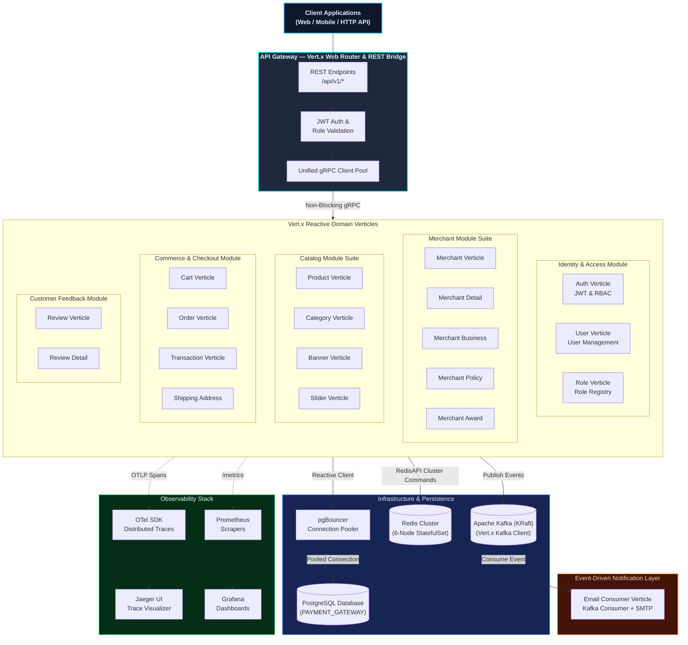
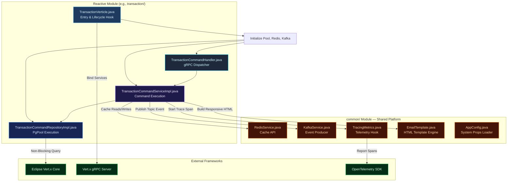
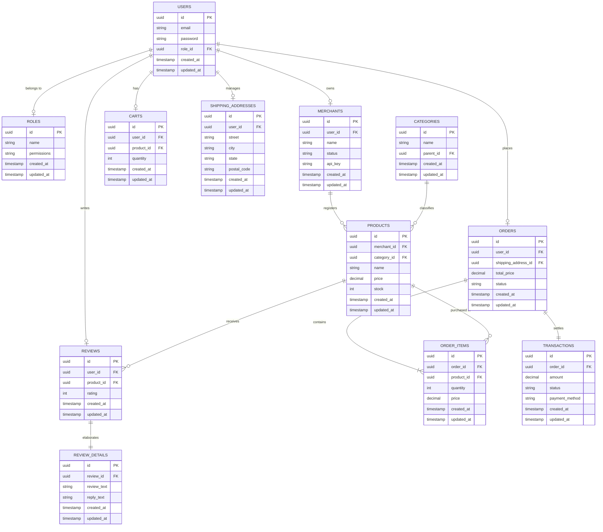

# Distributed Modular Monolith — Java 21 & Eclipse Vert.x E-Commerce Platform

A production-grade, highly resilient **reactive modular monolith e-commerce platform** built with **Java 21** and the **Eclipse Vert.x** toolkit. Engineered around Domain-Driven Design (DDD) service boundaries, this platform achieves high throughput, low latency, and non-blocking asynchronous event execution, all while retaining the deployment and operational simplicity of a single monorepo unit.

Each business domain exists in its own isolated module with a clean architecture design, communicating synchronously via type-safe **gRPC** and asynchronously via an event-driven **Kafka** backbone.

---

## Key Architectural Innovations (Java 21 + Vert.x)

- **Reactive Non-Blocking Core**: Every service utilizes the Vert.x reactive execution model. All I/O operations (database queries, Redis caching, gRPC, and Kafka events) run on the non-blocking **Event Loop** with `Future` composition, completely avoiding traditional thread-per-request blocking overhead.
- **Java 21 Native Features**: Uses Java 21 features including type-safe **Record Classes** for immutable DTOs, **Pattern Matching** for cleaner domain state validation, and modern collections.
- **Distributed Cache (Redis Cluster)**: Native integration with **Redis Cluster** in Java Vert.x. Transparently switches between standalone and cluster client modes via environment variables (`REDIS_CLUSTER_ENABLED` and `REDIS_CLUSTER_ENDPOINTS`).
- **Unified gRPC Inter-Service Fabric**: Strongly-typed synchronous service-to-service communication is powered by Vert.x gRPC clients, leveraging unified client-side socket connection pooling.
- **Modern Event-Driven Architecture (KRaft Kafka)**: Asynchronous actions (such as automated email dispatch on merchant onboarding, document upload, and transaction creation) are decoupled through the Vert.x Kafka Client interacting with an Apache Kafka cluster running in modern **KRaft mode** (no Zookeeper dependency).
- **Observability-First Philosophy**: Instrumented from the ground up with OpenTelemetry traces, Prometheus application metrics, pgBouncer connection pooling metrics, Logback structured logging, and Grafana dashboards.

---

## Domain & Module Matrix

| Domain / Module | Technology Stack & Features |
|:---|:---|
| **API Gateway** | Unified REST entry point utilizing Vert.x Web router. Validates JWT, routes requests, and marshals JSON payloads into type-safe gRPC commands. Supports modular sub-handlers. |
| **Auth & Users** | Secure registration, role-based access control (RBAC), bcrypt hashing, JWT access/refresh token generation. |
| **Merchants** | Onboarding pipelines, verified registration, custom document uploads, auto-generated secure API keys (`mc_...`). |
| **Catalog & Products** | High-performance catalog searching, category mapping, product inventory tracking, slider/banner systems. |
| **Commerce & Checkout** | Shopping carts, reactive order lifecycle handling, shipping address directory. |
| **Transactions** | Payment recording, transaction status tracking, and event-driven confirmation pipelines. |
| **Email Service** | Asynchronous Kafka event consumer. Ingests notification payloads and dispatches responsive HTML email templates. |

---

## Comprehensive Architecture Blueprint



---

## Internal Service Architecture (Vert.x Verticle Pattern)

Every module uses a custom **CQRS & Clean Architecture** implementation with strict dependency control:



---

## Getting Started & Local Development

### Prerequisites

Ensure the following tools are installed:
- **Java 21 JDK** (GraalVM or Eclipse Temurin recommended)
- **Apache Maven 3.9+**
- **Docker & Docker Compose**

### 1. Clone the Repository

```bash
git clone https://github.com/MamangRust/modular-monolith-vertx-ecommerce.git
cd modular-monolith-vertx-ecommerce
```

### 2. Build the Entire System

From the root directory:
```bash
mvn clean compile
```

To compile specific modules individually:
```bash
mvn clean compile -pl transaction
mvn clean compile -pl merchant
```

### 3. Run the Stack Locally

Launch the infrastructure services (PostgreSQL, 6-node Redis Cluster, Kafka in KRaft mode, pgBouncer) and all modular monolith containers:
```bash
docker-compose --env-file docker.env up --build
```

### 4. Local Ports Map

| Port | Service Component | Interface Protocol |
|:---|:---|:---|
| **80 / 5000** | REST API Gateway | HTTP / REST |
| **50051** | Auth Service | gRPC |
| **50053** | User & Identity | gRPC |
| **50055** | Merchant Suite | gRPC |
| **50057** | Orders Module | gRPC |
| **50059** | Transactions Module | gRPC |
| **3000** | Grafana Dashboards | HTTP |
| **9090** | Prometheus Metrics | HTTP |
| **16686** | Jaeger Traces | HTTP |

---

## Kubernetes Orchestration (deployments/kubernetes/)

Production deployments are managed using cloud-native Kubernetes manifests with robust orchestration defaults:

### 1. Architectural Highlights
- **High Availability Redis Cluster**: Configured as a **6-replica StatefulSet** utilizing headless services (`clusterIP: None`) for precise internal pod addressing. An automatic bootstrapping job handles initial cluster ring allocation.
- **Kafka KRaft Broker**: Integrated natively as a KRaft controller/broker container, fully omitting obsolete Zookeeper instances for rapid startup and lean resource usage.
- **Autoscaling (HPA)**: Integrated Horizontal Pod Autoscalers dynamically scale active deployment replicas (such as `auth`, `apigateway`, `transaction`) between `2` and `10` pods based on average CPU utilisation.
- **Central ConfigMap Management**: Environment definitions are centralized in `configsmaps.yaml` with reactive database URLs matching standard configurations.

### 2. Deploying to a Cluster
Create the namespace and load system variables, database configurations, and secrets first, then apply deployments:
```bash
# 1. Initialize namespace
kubectl apply -f deployments/kubernetes/namespace.yaml

# 2. Apply ConfigMaps and Secrets
kubectl apply -f deployments/kubernetes/configsmaps.yaml
kubectl apply -f deployments/kubernetes/secrets.yaml

# 3. Spin up Postgres & persistent volumes
kubectl apply -f deployments/kubernetes/postgres-pvc.yaml
kubectl apply -f deployments/kubernetes/postgres-service.yaml
kubectl apply -f deployments/kubernetes/postgres-deployment.yaml

# 4. Deploy the 6-Node Redis Cluster & Trigger Initialization
kubectl apply -f deployments/kubernetes/redis-service.yaml
kubectl apply -f deployments/kubernetes/redis-deployment.yaml
kubectl apply -f deployments/kubernetes/redis-cluster-creator.yaml

# 5. Apply the rest of the Microservices & Observability tools
kubectl apply -f deployments/kubernetes/
```

---

## Observability Matrix

| Pillar | Service Integration | Visualization Tooling |
|:---|:---|:---|
| **Distributed Tracing** | OpenTelemetry Java SDK automatically generates trace spans across gateway and RPC service jumps. | **Jaeger UI** - view end-to-end service hop details and query slow paths. |
| **Application Metrics** | Vert.x Micrometer Metrics exporter. | **Prometheus** - gathers database pool sizes, HTTP/gRPC latency, and cache hit ratios. |
| **Centralized Logging** | Logback SLF4J formatted with JSON output formats. | **Loki** - aggregated logs from all modular pods, searchable in Grafana. |

---

## Database Schema (ERD)

The relational database is orchestrated under the unified `PAYMENT_GATEWAY` database (leveraged cleanly by each module). Below is the logical data layout model represented as a native **Mermaid.js Entity-Relationship Diagram**:



---

<p align="center">
  Built with Eclipse Vert.x, Java 21, and a passion for modern reactive system architecture.
</p>