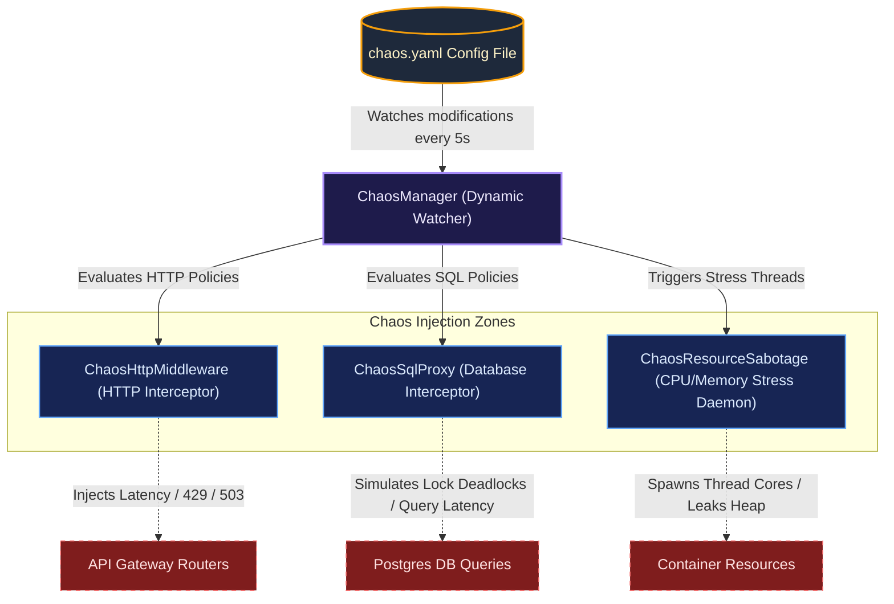

# 🛡️ Reactive Chaos Engineering Platform

The E-Commerce platform features a built-in **reactive Chaos Engineering engine** to continuously test system resilience under failure conditions (database latency/deadlocks, slow HTTP endpoints, CPU stress, and memory leaks). 

By injecting controlled failures into the application layer, database proxies, and host resources, we can audit how gracefully the modular monolith and API Gateway handle degradation in staging/production environments.

---

## ⚙️ Architecture & Mechanics

The chaos engine is managed by the [ChaosManager](./common/src/main/java/io/example/common/chaos/ChaosManager.java) class located in the `common` module. It dynamically monitors the [chaos.yaml](./chaos.yaml) policy file:



### ⚡ Hot-Reloading Configuration
The engine checks `chaos.yaml` for modifications every **5 seconds**. Any changes made to the configuration file (enabling policies, editing latency values, changing error rates) are **instantly hot-reloaded** into the running Java processes without requiring a rebuild, redeployment, or service restart.

---

## 🎯 Injection Mechanisms

### 1. HTTP Routing Chaos
* **Class**: `ChaosHttpMiddleware.java`
* **Implementation**: Intercepts HTTP requests at the API Gateway router before proxying them to internal services.
* **Capabilities**: 
  - Inject custom latency/delays (e.g., simulating slow network responses).
  - Inject specific HTTP error status codes (e.g., `429 Too Many Requests` or `503 Service Unavailable`).
  - Abruptly drop connections to simulate network splits.

### 2. Database SQL Chaos
* **Class**: `ChaosSqlProxy.java`
* **Implementation**: Wraps database `Pool` clients in a dynamic JDK proxy that intercepts SQL query executions.
* **Capabilities**:
  - Match queries targeting specific database tables (e.g., `users`, `products`, `orders`).
  - Inject custom query execution delays.
  - Fail queries with custom SQL exceptions (e.g., simulating deadlocks: `ERROR: deadlock detected`).

### 3. Resource Stress Chaos
* **Class**: `ChaosResourceSabotage.java`
* **Implementation**: Spawns background worker threads within the JVM on command.
* **Capabilities**:
  - **CPU Stress**: Spawns high-priority spinner loops consuming target CPU cores.
  - **Memory Stress**: Allocates large byte arrays in a background list to trigger high JVM Heap utilization and eventual OOMs.

---

## 🛠️ Configuration Guide (`chaos.yaml`)

Edit the [chaos.yaml](./chaos.yaml) file at the root of the project to control the chaos simulation.

```yaml
warmup_duration: "10s"
enable_default_ignored: true
policies:
  # Example 1: Slow down checkout endpoints to test API Gateway resilience
  - name: "http-get-products-limit"
    type: "http"
    target: "GET:/products"
    enabled: true        # Activates policy instantly
    errorChance: 0.5     # 50% probability of failure
    errorCode: 429
    errorBody: '{"error":"too_many_requests","message":"Rate limit exceeded by chaos simulation"}'
    latencyMs: 1000      # Delay request by 1000ms before returning error or success

  # Example 2: Inject simulated SQL deadlock exceptions on users queries
  - name: "sql-user-query-deadlock"
    type: "sql"
    target: "users"
    enabled: true
    errorChance: 0.3     # 30% probability of query failure
    errorMessage: "ERROR: deadlock detected (simulated chaos)"
    latencyMs: 300

  # Example 3: Exhaust CPU cores on target containers
  - name: "cpu-pressure-test"
    type: "cpu"
    enabled: false
    cpuCores: 2          # Lock up 2 CPU cores
    duration: "2m"       # Run for 2 minutes

  # Example 4: Leak memory on target JVMs
  - name: "memory-leak-test"
    type: "memory"
    enabled: false
    memoryMb: 256        # Leak 256MB of Heap Memory
    duration: "1m"
```

---

## 📈 Verifying Chaos Impact

1. **Check Logs**: When a chaos event is triggered, matching services will output warnings:
   ```log
   [INFO] 🔥 Injecting HTTP chaos [Policy: http-get-products-limit] to request: GET /products
   [INFO] 🔥 Injecting SQL chaos [Policy: sql-user-query-deadlock] for query: SELECT * FROM users WHERE id = $1
   ```
2. **Observe Metrics**: Monitor Prometheus/Grafana graphs to verify:
   - Request latency spikes under HTTP chaos.
   - Database connection pool exhaustion under SQL delay injection.
   - Spikes in container CPU/Memory metrics.
