# Order, Order Item & Transaction — Panduan Alur Lengkap (Model → Handler)

Dokumen ini menjelaskan implementasi **Order Service**, **Order Item Service**,
**Transaction Service**, dan bagian **Product Service** yang berkaitan dengan
stok (inventory) pada project **Vert.x Point of Sale** (Java 21, Vert.x 4.5,
gRPC, PostgreSQL, Redis, Kafka). Alur dijelaskan berlapis dari
**model/entity**, **proto contract**, **handler gRPC**, **service (business
logic)**, hingga **repository (SQL)** — plus bagaimana request masuk dari
**API Gateway** (HTTP/JSON) lalu diteruskan via gRPC.

> **Catatan pemutakhiran:** dokumen ini diselaraskan dengan implementasi
> terkini: port gRPC baru (order `50055`, product `50056`, order_item `50057`,
> transaction `50058`), RPC stok atomik `DecrementStock` / `IncrementStock`
> pada Product Service, validasi request transaction yang lebih eksplisit,
> serta `GrpcServerBinder` / `GrpcExceptionMapper` yang dipakai semua handler.

> Dokumen ini adalah versi yang **diselaraskan dengan implementasi aktual**
> project point-of-sale ini. Berbeda dengan versi e-commerce sebelumnya,
> project POS **tidak** memiliki Shipping Address Service, Wallet Service,
> pola transactional outbox, maupun idempotency key — transaksi POS adalah
> pencatatan pembayaran tunai/sederhana yang langsung ditulis ke PostgreSQL.
>
> Referensi lintas dokumen: [`PLANNING.md`](PLANNING.md),
> [`SUPER_PLANNING.md`](SUPER_PLANNING.md),
> [`ERROR_HANDLING_SUMMARY.md`](ERROR_HANDLING_SUMMARY.md),
> [`KAFKA_AUDIT.md`](KAFKA_AUDIT.md).

---

## Daftar Isi

1. [Arsitektur & Alur Request](#1-arsitektur--alur-request)
2. [Skema Database](#2-skema-database)
3. [Proto Contract (gRPC)](#3-proto-contract-grpc) — Order, Order Item, Transaction, Product (stok)
4. [Layer Model / Entity](#4-layer-model--entity)
5. [Layer Handler (gRPC)](#5-layer-handler-grpc)
6. [Layer Service (Business Logic)](#6-layer-service-business-logic)
7. [Layer Repository (SQL & gRPC Client)](#7-layer-repository-sql--grpc-client)
8. [Alur Create Order (Detail)](#8-alur-create-order-detail)
9. [Alur Create Transaction (Detail)](#9-alur-create-transaction-detail)
10. [Soft Delete / Trash Pattern](#10-soft-delete--trash-pattern)
11. [Caching Redis](#11-caching-redis)
12. [Event & Kafka](#12-event--kafka)
13. [Error Handling](#13-error-handling)
14. [Ringkasan File per Service](#14-ringkasan-file-per-service)

---

## 1. Arsitektur & Alur Request

Ketiga service mengikuti pola **CQRS** (Command Query Responsibility
Segregation) yang sama dengan service lain di repo:

```text
Client / Frontend
      │  HTTP/JSON (REST)
      ▼
API Gateway (apigateway)  ── port 8080
  ├─ JWT Middleware
  ├─ OrderProxyHandler / TransactionProxyHandler / OrderItemProxyHandler (mapping JSON → protobuf)
  ▼
gRPC (HTTP/2)
      │
      ├─ Order Service           (order)            ── port 50055
      │    OrderCommandHandler / OrderQueryHandler
      │    OrderCommandServiceImpl / OrderQueryServiceImpl
      │    OrderStatsServiceImpl / OrderStatByMerchantServiceImpl
      │    PostgreSQL (orders)   ← service komposisi: memanggil cashier,
      │                           merchant, product, order-item via gRPC
      │
      ├─ Order Item Service      (order_item)       ── port 50057
      │    OrderItemCommandHandler / OrderItemQueryHandler
      │    OrderItemCommandServiceImpl / OrderItemQueryServiceImpl
      │    OrderItemCommandRepositoryImpl / OrderItemQueryRepositoryImpl
      │    PostgreSQL (order_items)
      │
      ├─ Transaction Service     (transaction)      ── port 50058
      │    TransactionCommandHandler / TransactionQueryHandler
      │    TransactionStatsStatusHandler / TransactionStatsMethodHandler
      │    TransactionCommandServiceImpl / TransactionQueryServiceImpl
      │    TransactionStatsServiceImpl
      │    PostgreSQL (transactions) + Kafka (notifikasi email)
      │
      └─ Product Service          (product)          ── port 50056
           ProductCommandHandler / ProductQueryHandler
           ProductCommandServiceImpl / ProductQueryServiceImpl
           ProductCommandRepositoryImpl / ProductQueryRepositoryImpl
           PostgreSQL (products)  ← dipanggil Order Service untuk: baca
                                    harga/stok (query) + decrement/increment
                                    stok atomik (command)
```

**Alur umum satu request (contoh: create order):**

```text
HTTP POST /api/orders  (JWT)
  → OrderProxyHandler.create        (parse JSON, mapping → protobuf)
  → gRPC OrderCommandService.Create
  → OrderCommandHandler.create      (konversi protobuf → domain request)
  → OrderCommandServiceImpl.createOrder  (business logic + validasi)
  → OrderCommandRepositoryImpl / gRPC client adapter (cashier, merchant,
     product, order-item)
  → PostgreSQL
  → balik ke handler → ApiResponseOrder (protobuf)
  → OrderProxyHandler.sendResponse  (JSON ke client)
```

### Diagram arsitektur (Mermaid `graph`)

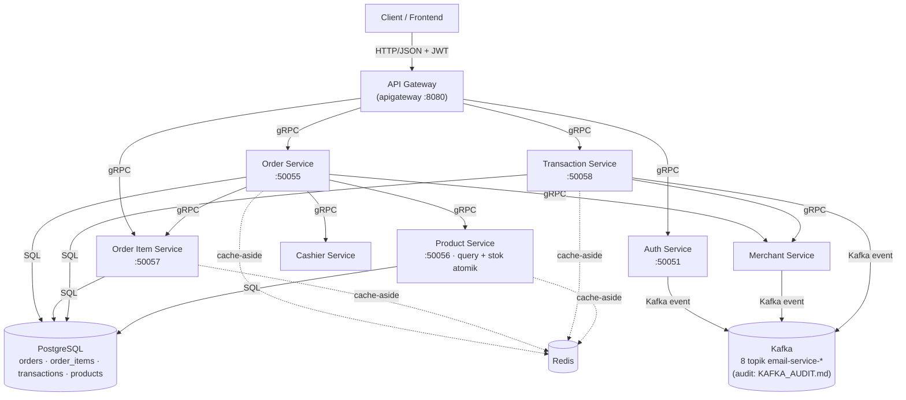

Semua service dideploy sebagai Verticle Vert.x (`OrderVerticle`,
`OrderItemVerticle`, `TransactionVerticle`) yang menjalankan gRPC server di
atas HTTP server Vert.x, dibungkus `ChaosGrpcServerInterceptor` (chaos
engineering).

**Resolusi address service lain** dilakukan via environment variable
`GRPC_<NAMA>_ADDR` / `GRPC_<NAMA>_PORT` dengan fallback host/port default
(`resolveGrpcAddress`). Port gRPC service sendiri diambil dari
`AppConfig.getGrpcPort()` (config `grpc_port`, dapat di-override env
`GRPC_PORT` — compose mengisinya per service), dan `OrderVerticle` /
`OrderItemVerticle` juga mendukung override eksplisit `GRPC_ORDER_PORT` /
`GRPC_ORDER_ITEM_PORT`.

Semua Verticle mendaftarkan handler gRPC-nya lewat **`GrpcServerBinder
.bindAll(grpcServer, handler)`** (bukan `handler.bindAll(grpcServer)`
langsung), dan semua handler command/query memetakan error domain ke gRPC
StatusException via **`GrpcExceptionMapper::toFailedFuture`** — bukan lagi
mengembalikan envelope `{ status: "error" }` dari sisi handler.

---

## 2. Skema Database

Schema dibuat di migration Flyway di `common/src/main/resources/db/migration/`
(sumber: `common/`), sedangkan `db-migration/` berisi runner one-shot.

### 2.1 Tabel `orders` (V9)

```sql
CREATE TABLE "orders" (
    "order_id" SERIAL PRIMARY KEY,
    "merchant_id" INT NOT NULL REFERENCES "merchants" ("merchant_id"),
    "cashier_id" INT NOT NULL REFERENCES "cashiers" ("cashier_id"),
    "total_price" BIGINT NOT NULL,
    "created_at" TIMESTAMP DEFAULT CURRENT_TIMESTAMP,
    "updated_at" TIMESTAMP DEFAULT CURRENT_TIMESTAMP,
    "deleted_at" TIMESTAMP DEFAULT NULL
);

CREATE INDEX idx_orders_merchant_id ON orders (merchant_id);
CREATE INDEX idx_orders_cashier_id ON orders (cashier_id);
CREATE INDEX idx_orders_created_at ON orders (created_at);
```

> Berbeda dengan versi e-commerce, order POS mengikat **cashier**
> (kasir/pegawai toko), bukan `user_id`. Kolom `total_price` bertipe
> **BIGINT** (Long) dan default-nya **bukan 0** — service selalu mengisinya
> eksplisit saat insert (`createOrder` memakai `total_price = 0` sementara,
> lalu di-update setelah item dihitung).

### 2.2 Tabel `order_items` (V10)

```sql
CREATE TABLE "order_items" (
    "order_item_id" SERIAL PRIMARY KEY,
    "order_id" INT NOT NULL REFERENCES "orders" ("order_id") ON DELETE CASCADE,
    "product_id" INT NOT NULL REFERENCES "products" ("product_id"),
    "quantity" INT NOT NULL,
    "price" INT NOT NULL,
    "created_at" TIMESTAMP DEFAULT CURRENT_TIMESTAMP,
    "updated_at" TIMESTAMP DEFAULT CURRENT_TIMESTAMP,
    "deleted_at" TIMESTAMP DEFAULT NULL
);

CREATE INDEX idx_order_items_order_id ON order_items (order_id);
CREATE INDEX idx_order_items_product_id ON order_items (product_id);
```

> `price` adalah **snapshot harga saat transaksi** (diambil dari service
> Product, bukan dari client). `order_id` memakai `ON DELETE CASCADE` —
> namun praktik service memakai soft delete (`deleted_at`) dan menghapus
> permanen per record (`DELETE ... WHERE deleted_at IS NOT NULL`), sehingga
> cascade hanyalah jaring pengaman DB yang jarang terpakai.

### 2.3 Tabel `transactions` (V11)

```sql
CREATE TABLE "transactions" (
    "transaction_id" SERIAL PRIMARY KEY,
    "order_id" INT NOT NULL REFERENCES "orders" ("order_id"),
    "merchant_id" INT NOT NULL REFERENCES "merchants" ("merchant_id"),
    "payment_method" VARCHAR(50) NOT NULL,
    "amount" INT NOT NULL,
    "change_amount" INT DEFAULT 0,
    "payment_status" VARCHAR(20) NOT NULL DEFAULT 'completed',
    "created_at" TIMESTAMP DEFAULT CURRENT_TIMESTAMP,
    "updated_at" TIMESTAMP DEFAULT CURRENT_TIMESTAMP,
    "deleted_at" TIMESTAMP DEFAULT NULL
);

CREATE INDEX idx_transactions_order_id ON transactions (order_id);
CREATE INDEX idx_transactions_payment_status ON transactions (payment_status);
CREATE INDEX idx_transactions_created_at ON transactions (created_at);
```

> Kolom `change_amount` adalah uang kembalian (khas kasir POS).
> `payment_status` default DB `'completed'`, namun `Transaction.fromRow`
> memetakan nilai status ke enum `PaymentStatus` (lihat bagian 4.2).
>
> **Penting:** di implementasi POS saat ini tidak ada kolom
> `idempotency_key`, `card_number`, maupun tabel `outbox` — transaction
> langsung ditulis ke tabel dan event email dikirim langsung ke Kafka
> (bukan lewat outbox).

### 2.4 Relasi antar tabel (ER Diagram)

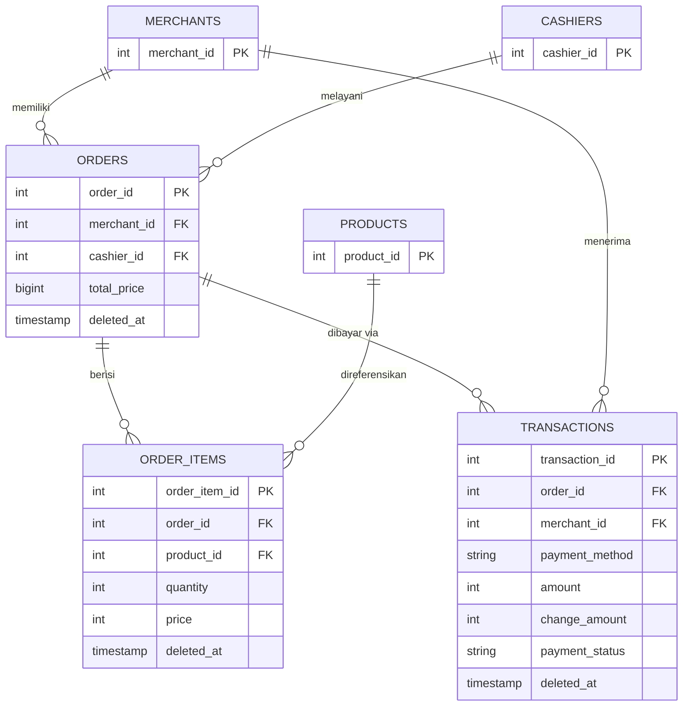

---

## 3. Proto Contract (gRPC)

### 3.1 Order Service — `common/src/main/proto/order/`

| File | Isi |
|---|---|
| `order.proto` | `OrderResponse`, `OrderResponseDeleteAt`, `ApiResponseOrder`, `ApiResponsePaginationOrder`, request stats bulanan/tahunan, response stats |
| `order_command.proto` | `CreateOrderRequest`, `UpdateOrderRequest`, service `OrderCommandService` |
| `order_query.proto` | `ApiResponsePaginationOrderDeleteAt`, service `OrderQueryService` |

**`CreateOrderRequest` / `UpdateOrderRequest`:**

```proto
message CreateOrderItemRequest {
    int32 product_id = 1;
    int32 quantity   = 2;
}

message CreateOrderRequest {
    int32 merchant_id = 1;
    int32 cashier_id  = 2;
    repeated CreateOrderItemRequest items = 4;
}

message UpdateOrderItemRequest {
    int32 order_item_id = 1;
    int32 product_id    = 2;
    int32 quantity      = 3;
}

message UpdateOrderRequest {
    int32 order_id  = 1;
    int32 cashier_id = 2;
    repeated UpdateOrderItemRequest items = 3;
}
```

**Service `OrderCommandService`:**

| RPC | Request | Response |
|---|---|---|
| `Create` | `CreateOrderRequest` | `ApiResponseOrder` |
| `Update` | `UpdateOrderRequest` | `ApiResponseOrder` |
| `TrashedOrder` | `FindByIdOrderRequest` | `ApiResponseOrderDeleteAt` |
| `RestoreOrder` | `FindByIdOrderRequest` | `ApiResponseOrderDeleteAt` |
| `DeleteOrderPermanent` | `FindByIdOrderRequest` | `ApiResponseOrderDelete` |
| `RestoreAllOrder` | `google.protobuf.Empty` | `ApiResponseOrderAll` |
| `DeleteAllOrderPermanent` | `google.protobuf.Empty` | `ApiResponseOrderAll` |

**Service `OrderQueryService`** (`order_query.proto`): `FindAll`,
`FindByMerchant`, `FindById`, `FindByActive`, `FindByTrashed`, plus stats
revenue: `FindMonthlyTotalRevenue`, `FindYearlyTotalRevenue`,
`FindMonthlyTotalRevenueById` / `FindYearlyTotalRevenueById` (stub — kembali
"Not implemented"), `FindMonthlyTotalRevenueByMerchant`,
`FindYearlyTotalRevenueByMerchant`, `FindMonthlyRevenue`, `FindYearlyRevenue`,
`FindMonthlyRevenueByMerchant`, `FindYearlyRevenueByMerchant`.

**`OrderResponse`:**

```proto
message OrderResponse {
    int32 id          = 1;
    int32 merchant_id = 2;
    int32 cashier_id  = 3;
    int64 total_price = 4;   // BIGINT di DB
    string created_at = 5;
    string updated_at = 6;
}
```

### 3.2 Order Item Service — `common/src/main/proto/order_item/`

| File | Isi |
|---|---|
| `order_item.proto` | `OrderItemResponse`, `OrderItemResponseDeleteAt`, `ApiResponseOrderItem`, `ApiResponsesOrderItem`, `FindByIdOrderItemRequest` |
| `order_item_command.proto` | `CreateOrderItemRequest` (membawa `price`), `UpdateOrderItemRequest`, service `OrderItemCommandService` |
| `order_item_query.proto` | `ApiResponsePaginationOrderItem`, service `OrderItemService` |

**Service `OrderItemCommandService`:**

| RPC | Request | Response |
|---|---|---|
| `CreateOrderItem` | `CreateOrderItemRequest` | `ApiResponseOrderItem` |
| `UpdateOrderItem` | `UpdateOrderItemRequest` | `ApiResponseOrderItem` |
| `TrashedOrderItem` | `FindByIdOrderItemRequest` | `ApiResponseOrderItemDeleteAt` |
| `RestoreOrderItem` | `FindByIdOrderItemRequest` | `ApiResponseOrderItemDeleteAt` |
| `DeleteOrderItemPermanent` | `FindByIdOrderItemRequest` | `ApiResponseOrderItemDelete` |
| `RestoreAllOrderItem` | `google.protobuf.Empty` | `ApiResponseOrderItemAll` |
| `DeleteAllOrderItemPermanent` | `google.protobuf.Empty` | `ApiResponseOrderItemAll` |

**Service `OrderItemService` (query)** (`order_item_query.proto`): `FindAll`,
`FindByActive`, `FindByTrashed`, `FindOrderItemByOrder`.

> **Pemutakhiran proto:** field pagination pada `ApiResponsePaginationOrderItem`
> / `ApiResponsePaginationOrderItemDeleteAt` kini bernama `pagination` (bukan
> `paginationMeta`) — diselaraskan dengan `common/api.proto` `PaginationMeta`.

> Tidak ada RPC `CalculateTotalPrice` di proto order_item. Perhitungan total
> dilakukan di **Order Service** melalui `OrderItemQueryRepositoryImpl
> .calculateTotalPrice(orderId)` yang memanggil `FindOrderItemByOrder` lalu
> menjumlahkan `Σ(quantity × price)` di sisi client (lihat bagian 7.1).

### 3.3 Transaction Service — `common/src/main/proto/transaction/`

| File | Isi |
|---|---|
| `transaction.proto` | `TransactionResponse`, `TransactionResponseDeleteAt`, `ApiResponseTransaction`, `ApiResponsePaginationTransaction`, `FindByIdTransactionRequest` |
| `transaction_command.proto` | `CreateTransactionRequest`, `UpdateTransactionRequest`, service `TransactionCommandService` |
| `transaction_query.proto` | `FindAllTransactionRequest`, `FindAllTransactionMerchantRequest`, service `TransactionQueryService` |
| `stats/transaction_stats_status.proto` | Stats sukses/gagal bulanan & tahunan (+ per merchant), service `TransactionStatsStatusService` |
| `stats/transaction_stats_method.proto` | Stats breakdown metode pembayaran, service `TransactionStatsMethodService` |

**Service `TransactionCommandService`:**

| RPC | Request | Response |
|---|---|---|
| `Create` | `CreateTransactionRequest` | `ApiResponseTransaction` |
| `Update` | `UpdateTransactionRequest` | `ApiResponseTransaction` |
| `TrashedTransaction` | `FindByIdTransactionRequest` | `ApiResponseTransactionDeleteAt` |
| `RestoreTransaction` | `FindByIdTransactionRequest` | `ApiResponseTransactionDeleteAt` |
| `DeleteTransactionPermanent` | `FindByIdTransactionRequest` | `ApiResponseTransactionDelete` |
| `RestoreAllTransaction` | `google.protobuf.Empty` | `ApiResponseTransactionAll` |
| `DeleteAllTransactionPermanent` | `google.protobuf.Empty` | `ApiResponseTransactionAll` |

**Service `TransactionQueryService`:** `FindAll`, `FindByMerchant`, `FindById`,
`FindByActive`, `FindByTrashed`.

**`CreateTransactionRequest`:**

```proto
message CreateTransactionRequest {
  int32  order_id       = 1;
  int32  merchant_id    = 2;
  string payment_method = 3;
  int32  amount         = 4;
  string payment_status = 5;   // opsional; default "pending" bila kosong
}
```

> Catatan: `amount` **dipercaya dari client** (berbeda dari versi e-commerce
> yang menghitung ulang server-side dari order items). Validasi hanya memastikan
> `amount > 0`, `order_id > 0`, dan `payment_method` tidak kosong. Tidak ada
> idempotency key maupun debit wallet.

### 3.4 Product Service (stok) — `common/src/main/proto/product/`

| File | Isi |
|---|---|
| `product_command.proto` | `CreateProductRequest`, `UpdateProductRequest`, **`DecrementStockRequest`**, **`IncrementStockRequest`**, service `ProductCommandService` |
| `product.proto` | `ProductResponse`, `ProductResponseDeleteAt`, `ApiResponseProduct`, `ApiResponseProductAll`, `FindByIdProductRequest` |
| `product_query.proto` | request/response query produk, service `ProductQueryService` |

Dua RPC baru yang dipakai Order Service untuk mengelola stok secara **atomik**
di sisi database:

```proto
// Atomically subtracts quantity from count_in_stock, guarded so stock never
// goes negative (used by the order service when items are sold).
message DecrementStockRequest {
    int32 product_id = 1;
    int32 quantity   = 2;
}

// Atomically adds quantity back to count_in_stock (used by the order service
// to compensate/roll back stock when an order fails part-way through).
message IncrementStockRequest {
    int32 product_id = 1;
    int32 quantity   = 2;
}

service ProductCommandService {
    rpc Create(CreateProductRequest) returns (ApiResponseProduct);
    rpc Update(UpdateProductRequest) returns (ApiResponseProduct);
    rpc TrashedProduct(FindByIdProductRequest) returns (ApiResponseProductDeleteAt);
    rpc RestoreProduct(FindByIdProductRequest) returns (ApiResponseProductDeleteAt);
    rpc DeleteProductPermanent(FindByIdProductRequest) returns (ApiResponseProductDelete);
    rpc DecrementStock(DecrementStockRequest) returns (ApiResponseProduct);  // NEW
    rpc IncrementStock(IncrementStockRequest) returns (ApiResponseProduct);  // NEW
    rpc RestoreAllProduct(google.protobuf.Empty) returns (ApiResponseProductAll);
    rpc DeleteAllProductPermanent(google.protobuf.Empty) returns (ApiResponseProductAll);
}
```

Kedua RPC mengembalikan `ApiResponseProduct` (dengan `ProductResponse.data`
yang memuat `count_in_stock` terbaru). Order Service membaca field ini untuk
memastikan decrement benar-benar terjadi (guard anti kegagalan diam).

---

## 4. Layer Model / Entity

### 4.1 Order Service — `order/src/main/java/io/example/order/model/`

**`Order`** (`Order.java`)

| Field | Kolom DB | Tipe Java |
|---|---|---|
| `orderId` | `order_id` | `Long` |
| `merchantId` | `merchant_id` | `Long` |
| `cashierId` | `cashier_id` | `Long` |
| `totalPrice` | `total_price` | `Long` |
| `createdAt` / `updatedAt` / `deletedAt` | `created_at` / `updated_at` / `deleted_at` | `Timestamp` |

Menyediakan konversi:
- `toJson()` → `JsonObject` (cache Redis / logging)
- `fromJson(JsonObject)` → `Order`
- `fromRow(Row)` → `Order` (dari hasil query Vert.x SQL client)

**`OrderItem`** (`OrderItem.java`) — representasi item pesanan:
`orderItemId`, `orderId`, `productId`, `quantity`, `price`, timestamp
lifecycle. Konversi sama (`toJson` / `fromJson` / `fromRow`).

**`Product`** (`Product.java`) — DTO hasil query gRPC ke Product Service:
`productId`, `name`, `price`, `countInStock`.

### 4.2 Transaction Service — `transaction/src/main/java/io/example/transaction/model/`

**`Transaction`** (`Transaction.java`)

| Field | Kolom DB | Tipe Java |
|---|---|---|
| `transactionId` | `transaction_id` | `Long` |
| `orderId` | `order_id` | `Long` |
| `merchantId` | `merchant_id` | `Long` |
| `paymentMethod` | `payment_method` | `String` |
| `amount` | `amount` | `Integer` |
| `changeAmount` | `change_amount` | `Integer` |
| `status` | `payment_status` | `PaymentStatus` (enum) |
| `createdAt` / `updatedAt` / `deletedAt` | timestamp | `Timestamp` |

Catatan penting di `fromRow` / `fromJson`:
- Membaca kolom `payment_status` dan memetakan via `PaymentStatus.valueOf(...)`
  (fallback `PENDING` bila nilai tidak dikenal — mis. `'completed'` dari
  default DB dipetakan ke `PENDING`).
- `toJson()` menyimpan status sebagai `status.name()`.

**Enum `PaymentStatus`** (`transaction/enums/PaymentStatus.java`) — nilai yang
dipakai: `PENDING`, `SUCCESS`, `FAILED`, `REFUNDED`.

### 4.3 Order Item Service — `order_item/src/main/java/io/example/order_item/model/`

**`OrderItem`** (`OrderItem.java`) — field identik dengan `OrderItem` milik
order service: `orderItemId`, `orderId`, `productId`, `quantity`, `price`,
timestamp lifecycle. Konversi `toJson` / `fromJson` / `fromRow`.

---

## 5. Layer Handler (gRPC)

Handler adalah implementasi interface generated dari protobuf (Vert.x gRPC
server). Semua handler memakai `GrpcServerBinder.bindAll(...)` untuk
mendaftarkan method ke `GrpcServer`, dan `GrpcExceptionMapper::toFailedFuture`
untuk mengubah `Throwable` domain menjadi gRPC StatusException.

### 5.1 Order Service — `order/.../handler/`

**`OrderCommandHandler`** (`OrderCommandHandler.java`) — mengimplementasikan
`OrderCommandServiceApi`:

- `create(CreateOrderRequest)` → mapping protobuf → domain `CreateOrderRequest`
  (dengan daftar `CreateOrderItemRequest`) → `service.createOrder` →
  `ApiResponseOrder` via `ProtoConverter.toResponse`.
- `update(UpdateOrderRequest)` → domain `UpdateOrderRequest` →
  `service.updateOrder`.
- `trashedOrder` / `restoreOrder` / `deleteOrderPermanent` / `restoreAllOrder`
  / `deleteAllOrderPermanent` → delegasi langsung ke service.

**`OrderQueryHandler`** (`OrderQueryHandler.java`) — mengimplementasikan
`OrderQueryServiceApi`:

- `findAll` / `findByMerchant` / `findByActive` / `findByTrashed` → mapping ke
  domain `FindAllOrders` / `FindAllOrderMerchant`, memanggil service, lalu
  membungkus hasil dalam `ApiResponsePaginationOrder` /
  `ApiResponsePaginationOrderDeleteAt` dengan `PaginationMeta`
  (`ProtoConverter.toPaginationMeta` menghitung `totalPages`).
- `findById` → `service.findById(id)` → `ApiResponseOrder`.
- Method stats (revenue) → delegasi ke `OrderStatsService` /
  `OrderStatByMerchantService`. `findMonthlyTotalRevenueById` dan
  `findYearlyTotalRevenueById` dikembalikan sebagai stub (message
  "Not implemented for order stats directly").

### 5.2 Transaction Service — `transaction/.../handler/`

**`TransactionCommandHandler`** (`TransactionCommandHandler.java`) —
mengimplementasikan `TransactionCommandServiceApi`:

- `create(CreateTransactionRequest)` → domain `CreateTransactionRequest` →
  `service.createTransaction` → `ApiResponseTransaction` via
  `ProtoConverter.fromTransactionResponse`.
- `update` → domain `UpdateTransactionRequest` → `service.updateTransaction`.
- `trashedTransaction` / `restoreTransaction` / `deleteTransactionPermanent` /
  `restoreAllTransaction` / `deleteAllTransactionPermanent`.

**`TransactionQueryHandler`** (`TransactionQueryHandler.java`) —
mengimplementasikan `TransactionQueryServiceApi`:

- `findAll` / `findByActive` / `findByTrashed` / `findByMerchant` →
  pagination dengan `PaginationMeta` (default `page=1`, `pageSize=10`).
- `findById` → `ApiResponseTransaction`.

**`TransactionStatsStatusHandler`** & **`TransactionStatsMethodHandler`** —
handler stats: jumlah sukses/gagal bulanan & tahunan, breakdown per metode
pembayaran, dan varian per merchant (semua lewat `TransactionStatsService`).

### 5.3 Order Item Service — `order_item/.../handler/`

**`OrderItemCommandHandler`** — mengimplementasikan
`OrderItemCommandServiceApi`: `createOrderItem`, `updateOrderItem`,
`trashedOrderItem`, `restoreOrderItem`, `deleteOrderItemPermanent`,
`restoreAllOrderItem`, `deleteAllOrderItemPermanent`.

**`OrderItemQueryHandler`** — mengimplementasikan `OrderItemServiceApi`
(query): `findAll`, `findByActive`, `findByTrashed`, `findOrderItemByOrder`.

**`ProtoConverter`** — konversi model ↔ protobuf untuk kedua handler.

### 5.4 Product Service — `product/.../handler/`

**`ProductCommandHandler`** — mengimplementasikan
`pb.product.VertxProductCommandServiceGrpcServer`:

- `create` / `update` / `trashedProduct` / `restoreProduct` /
  `deleteProductPermanent` / `restoreAllProduct` / `deleteAllProductPermanent`
  — CRUD standar dengan konversi protobuf → domain → service →
  `ApiResponseProduct` / `ApiResponseProductDeleteAt` / `ApiResponseProductAll`.
- **`decrementStock(DecrementStockRequest)`** → `service.decrementStock(productId,
  quantity)` → `ApiResponseProduct` berstatus `"success"` (message "Stock
  decremented successfully").
- **`incrementStock(IncrementStockRequest)`** → `service.incrementStock(...)` →
  `ApiResponseProduct` (message "Stock incremented successfully").
- Semua method memakai `.recover(GrpcExceptionMapper::toFailedFuture)` sehingga
eror domain (mis. stok tidak cukup) menjadi gRPC StatusException.

**`ProductQueryHandler`** — mengimplementasikan `ProductQueryServiceApi`
(query): `findAll` / `findByActive` / `findByTrashed` / `findByMerchant` /
`findByCategoryName` / `findById` — pagination dengan `PaginationMeta`.

---

## 6. Layer Service (Business Logic)

### 6.1 Order Service

**`OrderCommandServiceImpl`** (`order/.../service/impl/OrderCommandServiceImpl.java`)

Dependensi (via constructor injection):
- `OrderCommandRepository`, `OrderQueryRepository` (SQL)
- `OrderItemCommandRepository`, `OrderItemQueryRepository` (gRPC → order-item service)
- `MerchantQueryRepository`, `CashierQueryRepository` (gRPC)
- `ProductQueryRepository`, `ProductCommandRepository` (gRPC → product service)
- `RedisService` (cache) + `TracingMetrics` (OpenTelemetry)

Method utama:

| Method | Deskripsi |
|---|---|
| `createOrder` | Validasi merchant + cashier exists → insert order (`total_price=0`) → untuk tiap item: cek produk exists + stok cukup, insert order item (harga dari produk, **bukan dari client**), lalu **decrement stok** (dilacak untuk kompensasi) → hitung ulang `total_price` → update order → evict cache. Bila gagal di tengah, stok yang sudah turun **di-rollback** via `incrementStock` |
| `updateOrder` | Cek order exists → validasi cashier → untuk tiap item: update bila `order_item_id > 0`, insert baru + decrement stok (dilacak untuk kompensasi) bila tanpa id → hitung ulang total → evict cache. Bila item baru gagal, stok yang sudah turun **di-rollback** via `incrementStock` |
| `trashedOrder` | Cek order aktif (`findById`) → **restore stok semua item aktif** (increment, dilacak) → soft delete order → evict cache. Bila trash gagal, stok yang sudah di-restore **di-revert** (decrement balik) |
| `restoreOrder` | Cek order trashed (`findByTrashedId`) → **decrement stok item aktif lagi** (dilacak) → restore order → evict cache. Bila restore gagal, stok yang sudah turun **di-kompensasi** (increment balik) |
| `deleteOrderPermanent` | Hapus permanen — **mensyaratkan order sudah di-trash** (`findByTrashedId`) |
| `restoreAllOrder` | `findAllTrashed()` (semua order trashed) → **per order**: decrement stok item aktif → `restoreOrder(orderId)` atomik (`UPDATE ... WHERE deleted_at IS NOT NULL RETURNING`). Bila `restoreOrder` null (order sudah di-restore request lain) → **undo decrement kita** (`restoreStockDecrements(..., false)`, tanpa swallow) lalu skip — bukan error; bila undo gagal, operasi **fail** (stok inkonsisten). Bila decrement gagal → kompensasi order itu + error asli menang. `restoredCount == 0` → NotFound. Partial completion: order yang sudah ter-restore sebelum kegagalan tetap ter-restore. Evict cache list setelah fase kompensasi |
| `deleteAllOrderPermanent` | Hapus permanen semua order trashed — **tidak** menyentuh stok (order dihapus selamanya = barang tidak terjual, stok tetap ter-restore) |

Helper penting:
- `validateMerchantAndCashier` / `validateCashier` — cek exists via gRPC.
- `processOrderItems` / `createAndProcessItem` — loop insert item + decrement
  stok. `decrementStockGuarded` memastikan response gRPC tidak kosong (anti
  kegagalan diam). Setiap decrement sukses dicatat ke `List<StockDecrement>`
  untuk kompensasi.
- `restoreStockDecrements(appliedDecrements, swallowErrors)` — increment balik
  semua produk yang sudah di-decrement saat order gagal; `swallowErrors=true`
  (kompensasi biasa) → error di-log dan di-swallow agar error asli tetap
  terlihat; `swallowErrors=false` (undo setelah kalah race restore) → error
  dipropagasi karena tidak ada error asli yang perlu dipertahankan.
- `processUpdateOrderItems` / `updateOrCreateItem` — update item lama atau
  buat item baru. Item baru (tanpa `order_item_id`) juga decrement stok yang
  dilacak ke `List<StockDecrement>` untuk kompensasi (via
  `restoreStockDecrements(..., true)`).
- `trashOrderWithStockRestore` / `restoreStockForOrderItems` — trash
  mengembalikan stok item aktif: increment tiap item, dilacak; bila trash
  gagal → `revertStockRestores` (decrement balik) dan error asli tetap menang.
- `restoreOrderWithStockDecrement` / `decrementStockForOrderItems` — restore
  menurunkan stok item aktif lagi (simetris); bila restore gagal →
  `restoreStockDecrements(..., true)` (increment balik) dan error asli tetap
  menang.
- `invalidateCache(orderId)` / `invalidateListCache()` — hapus `order:<id>`
  dan semua `order:list:*`.

> **Kompensasi stok:** `createOrder` dan `updateOrder` melacak setiap produk
> yang stok-nya berhasil di-decrement (`List<StockDecrement>`) — pada
> `updateOrder` hanya **item baru** (tanpa `order_item_id`) yang menyentuh
> stok. Bila pemrosesan item gagal di tengah, seluruh stok yang sudah turun
> **di-increment kembali** (`restoreStockDecrements(..., true)` → RPC
> `IncrementStock` ke product service), lalu error asli tetap dipropagasikan —
> error kompensasi tidak pernah menimpa error asli (hanya di-log). Kompensasi
> hanya berlaku pada fase pemrosesan item (bukan saat total/cache gagal
> setelah item ter-commit).
>
> **Simetris untuk trash/restore:** `trashedOrder` meng-increment stok item
> aktif (kebalikan dari penjualan) dan bila trash gagal stok di-revert
> (decrement balik); `restoreOrder` men-decrement stok item aktif lagi dan
> bila restore gagal stok di-kompensasi (increment balik). Keduanya memakai
> pola yang sama: melacak perubahan stok yang berhasil, revert/kompensasi
> saat operasi utama gagal, dan error asli selalu menang.

**`OrderQueryServiceImpl`** (`OrderQueryServiceImpl.java`) — `findAll`,
`findById`, `findByActive`, `findByTrashed`, `findByMerchant`. Semua memakai
pola **cache-aside**: cek Redis → miss → query DB → simpan di Redis (TTL 10
menit).

**`OrderStatsServiceImpl`** & **`OrderStatByMerchantServiceImpl`** — query
agregasi revenue (monthly/yearly, total revenue & jumlah order) dengan cache
Redis (prefix `order:stats:` / `order:stats:merchant:`).

### 6.2 Transaction Service

**`TransactionCommandServiceImpl`** (`transaction/.../service/impl/TransactionCommandServiceImpl.java`)

Dependensi: `TransactionCommandRepository`, `TransactionQueryRepository`
(SQL), gRPC adapter `MerchantQueryRepository` (mencari email kontak merchant
untuk notifikasi), plus `RedisService`, `TracingMetrics`, `KafkaService`.

Method utama:

| Method | Deskripsi |
|---|---|
| `createTransaction` | Validasi `order_id > 0`, `payment_method` tidak kosong, `amount > 0` → insert transaction → evict cache list → **kirim event email ke Kafka** → response |
| `updateTransaction` | Validasi id/order/payment/amount → update → 404 bila tidak ditemukan → evict cache |
| `trashTransaction` / `restoreTransaction` | Soft delete / restore (restore mensyaratkan trashed dulu) |
| `deletePermanent` | Hapus permanen — **mensyaratkan transaksi sudah di-trash** |
| `restoreAllTransactions` / `deleteAllPermanentTransactions` | Operasi massal |

Helper penting:
- `sendTransactionCreateEvent(transaction)` — ambil `contact_email` merchant
  via gRPC → `kafkaService.sendMessage("email-service-topic-transaction-create", ...)`
  dengan payload `{ email, subject, body }`. Bila kafka/null atau email tidak
  ditemukan → log warning dan **lanjut sukses** (graceful degradation).
- `invalidateCache(transactionId)` / `invalidateListCache()` — hapus
  `transaction:id:<id>` dan semua `transaction:list:*`.

> **Catatan:** berbeda dari versi e-commerce, `createTransaction` **tidak**
> memvalidasi order exists, tidak menghitung ulang amount dari order items,
> tidak ada idempotency key, tidak ada debit wallet, dan tidak ada
> transactional outbox.

**`TransactionQueryServiceImpl`** (`TransactionQueryServiceImpl.java`) —
`findAllTransaction`, `findByActiveTransaction`, `findByTrashedTransaction`,
`findAllTransactionByMerchant`, `findByIdTransaction` — semua cache-aside
dengan TTL 10 menit.

**`TransactionStatsServiceImpl`** — agregasi stats (success/failed
monthly/yearly, per metode pembayaran, dan varian per merchant) dengan cache
Redis.

### 6.3 Order Item Service

**`OrderItemCommandServiceImpl`** — method: `create`, `update`, `trash`,
`restore`, `deletePermanent` (wajib trashed dulu), `restoreAll`,
`deleteAllPermanent`. Setiap mutasi memanggil `invalidateCache(...)` /
`invalidateListCache()`.

Catatan penting:
- `trash(Long orderItemId)` memakai **order_item_id** (per item), bukan per
  order — order service me-trash order **tanpa** ikut me-trash item-nya.
- `deletePermanent` mengembalikan 400 bila record belum di-trash.

**`OrderItemQueryServiceImpl`** — `getAll`, `getActive`, `getTrashed`,
`getByOrderId` — cache-aside, prefix `order_item:`, TTL 10 menit.
`getByOrderId` mengembalikan 404 bila tidak ada item untuk order tersebut.

### 6.4 Product Service

**`ProductCommandServiceImpl`** (`product/.../service/impl/ProductCommandServiceImpl.java`)

Dependensi: `ProductCommandRepository` (SQL), `ProductQueryRepository` (SQL),
`CategoryQueryRepository` (gRPC → category), `MerchantQueryRepository` (gRPC →
merchant), `RedisService`, `TracingMetrics`.

Method utama:

| Method | Deskripsi |
|---|---|
| `create` | Validasi merchant exists + category exists → insert produk → evict cache list |
| `update` | Validasi merchant + category → update (`deleted_at IS NULL`) → 404 bila null → evict cache |
| `trash` / `restore` | Soft delete / restore standar (`restore` mensyaratkan trashed dulu via `findByTrashedId`) |
| `deletePermanent` | Hapus permanen — **wajib sudah di-trash** (`findByTrashedId` → 400 bila tidak) |
| `decrementStock` | **`commandRepository.decrementStock`** (SQL atomik `count_in_stock = count_in_stock - qty WHERE count_in_stock >= qty`) → bila null (produk hilang / stok kurang) → **`BadRequestException("Insufficient product stock")`** → evict cache |
| `incrementStock` | `commandRepository.incrementStock` (SQL `count_in_stock + qty`, tanpa guard negatif) → bila null (produk hilang / sudah di-trash) → `NotFoundException("Product not found")` → evict cache |
| `restoreAll` / `deleteAllPermanent` | Operasi massal (`count == 0` → `NotFoundException("No trashed products found")`) |

> **Guard stok ganda:** Order Service mengecek stok via `getProductById`
> (query) **sebelum** memanggil `decrementStock`. Namun cek ini bisa basi
> (race) — lapisan keamanan sesungguhnya ada di SQL `decrementStock` yang
> atomik: bila stok tersisa < qty pada saat UPDATE, tidak ada baris yang
> ter-update (return null) → `BadRequestException` → order ditolak. Dengan
> begitu stok **tidak mungkin negatif** bahkan saat dua order decrement
> bersamaan.

**`ProductQueryServiceImpl`** — `getAll`, `getActive`, `getTrashed`,
`getByMerchant` (filter kategori + rentang harga), `getByCategoryName`,
`getById` — semuanya cache-aside (prefix `product:`, TTL 10 menit).

---

## 7. Layer Repository (SQL & gRPC Client)

### 7.1 Order Service — `order/.../repository/`

**SQL (PostgreSQL langsung via Vert.x `Pool`):**

| Repository Impl | Query utama |
|---|---|
| `OrderCommandRepositoryImpl` | `INSERT INTO orders (merchant_id, cashier_id, total_price) ... RETURNING`, `UPDATE orders SET total_price ...`, `trashedOrder` (`SET deleted_at = NOW()`), `restoreOrder` (`UPDATE ... WHERE deleted_at IS NOT NULL RETURNING` — atomik), `DELETE ... AND deleted_at IS NOT NULL`, `deleteAllPermanentOrders` |
| `OrderQueryRepositoryImpl` | `findAllOrders`, `findByActive`, `findByTrashed`, `findByMerchant`, `findById`, `findByTrashedId`, `findAllTrashed` (semua order trashed, tanpa pagination) — memakai `COUNT(*) OVER ()` untuk total pagination dan `ILIKE '%' || $1 || '%'` untuk search (`order_id` / `total_price`) |
| `OrderStatsRepositoryImpl` | Agregasi revenue bulanan/tahunan (`SUM(total_price)`, `COUNT(order_id)`, `SUM(quantity)`) + varian `getMonthlyOrder` / `getYearlyOrder` |
| `OrderStatByMerchantRepositoryImpl` | Varian stats per merchant |

**gRPC client adapter** (berbicara ke service lain):

| Repository Impl | Target service | Fungsi |
|---|---|---|
| `CashierQueryRepositoryImpl` | cashier (port 50061) | cek cashier exists |
| `MerchantQueryRepositoryImpl` | merchant (port 50054) | cek merchant exists |
| `ProductQueryRepositoryImpl` | product (port 50056) | baca produk (harga & stok) via `VertxProductServiceGrpcClient` (`getProductById`) — fallback default di `OrderVerticle` 50062, di-override env `GRPC_PRODUCT_PORT` |
| `ProductCommandRepositoryImpl` | product | **decrement stock** (saat item dijual) & **increment stock** (kompensasi order gagal) via `VertxProductCommandServiceGrpcClient` (RPC `DecrementStock` / `IncrementStock` — lihat §3.4) |
| `OrderItemQueryRepositoryImpl` | order_item (port 50057) | `findOrderItemByOrder` + **`calculateTotalPrice`** (Σ qty×price di sisi order service) |
| `OrderItemCommandRepositoryImpl` | order_item | `createOrderItem`, `updateOrderItem` (via gRPC) |

### 7.2 Transaction Service — `transaction/.../repository/`

**SQL:**

| Repository Impl | Query utama |
|---|---|
| `TransactionCommandRepositoryImpl` | `createTransaction` (INSERT langsung), `updateTransaction`, `trashTransaction`, `restoreTransaction`, `deleteTransactionPermanently` (`AND deleted_at IS NOT NULL`), `restoreAllTransactions`, `deleteAllPermanentTransactions` |
| `TransactionQueryRepositoryImpl` | `getTransactions`, `getTransactionsActive` (= `getTransactions`), `getTransactionsTrashed`, `getTransactionByMerchant`, `getTransactionById`, `getTransactionByOrderId`, `findByTrashedId` |
| `TransactionStatsRepositoryImpl` | Agregasi stats sukses/gagal & per metode (monthly/yearly, ± per merchant) |

**gRPC client adapter:**

| Repository Impl | Target service | Fungsi |
|---|---|---|
| `MerchantQueryRepositoryImpl` | merchant (port 50054) | ambil `contact_email` merchant untuk notifikasi email |

### 7.3 Order Item Service — `order_item/.../repository/`

| Repository Impl | Query utama |
|---|---|
| `OrderItemCommandRepositoryImpl` | `INSERT INTO order_items ... RETURNING`, `UPDATE order_items SET quantity/price ...`, `trashOrderItem`, `restoreOrderItem`, `deleteOrderItemPermanently` (wajib trashed), `restoreAllOrdersItem`, `deleteAllPermanentOrdersItem` |
| `OrderItemQueryRepositoryImpl` | `getOrderItems`, `getOrderItemsActive`, `getOrderItemsTrashed`, `getOrderItemsByOrder`, `findByTrashedId` — pagination `COUNT(*) OVER ()`, search `order_id`/`product_id` ILIKE |

### 7.4 Product Service — `product/.../repository/`

**SQL (PostgreSQL langsung via Vert.x `Pool`):**

| Repository Impl | Query utama |
|---|---|
| `ProductCommandRepositoryImpl` | `createProduct` (INSERT … RETURNING), `updateProduct` (`WHERE deleted_at IS NULL`), `trashProduct` / `restoreProduct`, `deleteProductPermanently` (`AND deleted_at IS NOT NULL`), `restoreAllProducts`, `deleteAllPermanentProducts` — plus **`decrementStock`** / **`incrementStock`** |
| `ProductQueryRepositoryImpl` | `getProducts` / `getProductsActive` / `getProductsTrashed` (search ILIKE atas nama/deskripsi/brand/slug/barcode), `getProductsByMerchant` (filter kategori + `min_price`/`max_price` via CTE `filtered_products`), `getProductsByCategoryName`, `getProductById`, `findByTrashedId` |

**Detail SQL stok atomik (`ProductCommandRepositoryImpl`):**

```sql
-- Decrement: guard agar stok tidak pernah negatif; tidak ada baris yang
-- di-update (RETURNING kosong → null) bila produk hilang / di-trash / stok < qty
UPDATE products
SET count_in_stock = count_in_stock - $2, updated_at = CURRENT_TIMESTAMP
WHERE product_id = $1
  AND deleted_at IS NULL
  AND count_in_stock >= $2
RETURNING product_id, merchant_id, count_in_stock, ...;

-- Increment: tidak butuh guard (menambah stok tidak pernah negatif);
-- RETURNING kosong hanya bila produk hilang / di-trash
UPDATE products
SET count_in_stock = count_in_stock + $2, updated_at = CURRENT_TIMESTAMP
WHERE product_id = $1 AND deleted_at IS NULL
RETURNING product_id, merchant_id, count_in_stock, ...;
```

**gRPC client adapter:** `CategoryQueryRepositoryImpl` → category service
(cek kategori exists saat create/update) dan `MerchantQueryRepositoryImpl` →
merchant service (cek merchant exists).

---

## 8. Alur Create Order (Detail)

`POST /api/orders` dengan JWT → `OrderProxyHandler.create` (parse JSON →
protobuf) → gRPC → `OrderCommandHandler.create` →
`OrderCommandServiceImpl.createOrder`:

```text
1. Validasi referensi
   - merchant exists?  (gRPC merchant) → NotFoundException (404)
   - cashier exists?   (gRPC cashier)  → NotFoundException (404)

2. Insert order (orders) → total_price = 0 sementara

3. Loop setiap item pesanan
   - product exists?       (gRPC product query) → NotFoundException (404)
   - stok cukup?           (count_in_stock >= qty, cek query) → BadRequestException (400)
   - insert order item     (harga dari product.getPrice(), bukan client!)
   - decrement stock       (gRPC product command → SQL atomik
                            `count_in_stock >= qty`, guarded) — dicatat ke
                            List<StockDecrement> untuk kompensasi

   Bila salah satu langkah gagal (termasuk decrement yang return null
   karena stok tersisa < qty saat UPDATE atomik — race):
   → restoreStockDecrements(..., true): increment balik semua stok yang
     sudah turun (gRPC IncrementStock ke product service), lalu return
     error asli

4. Hitung ulang total
   - calculateTotalPrice(orderId) = Σ(price × quantity)  [di order service]
   - UPDATE orders SET total_price = <total>

5. Evict cache Redis (order:<id>, order:list:*)

6. Response → OrderResponse (status "success", HTTP 201)
```

### Diagram sequence — Create Order

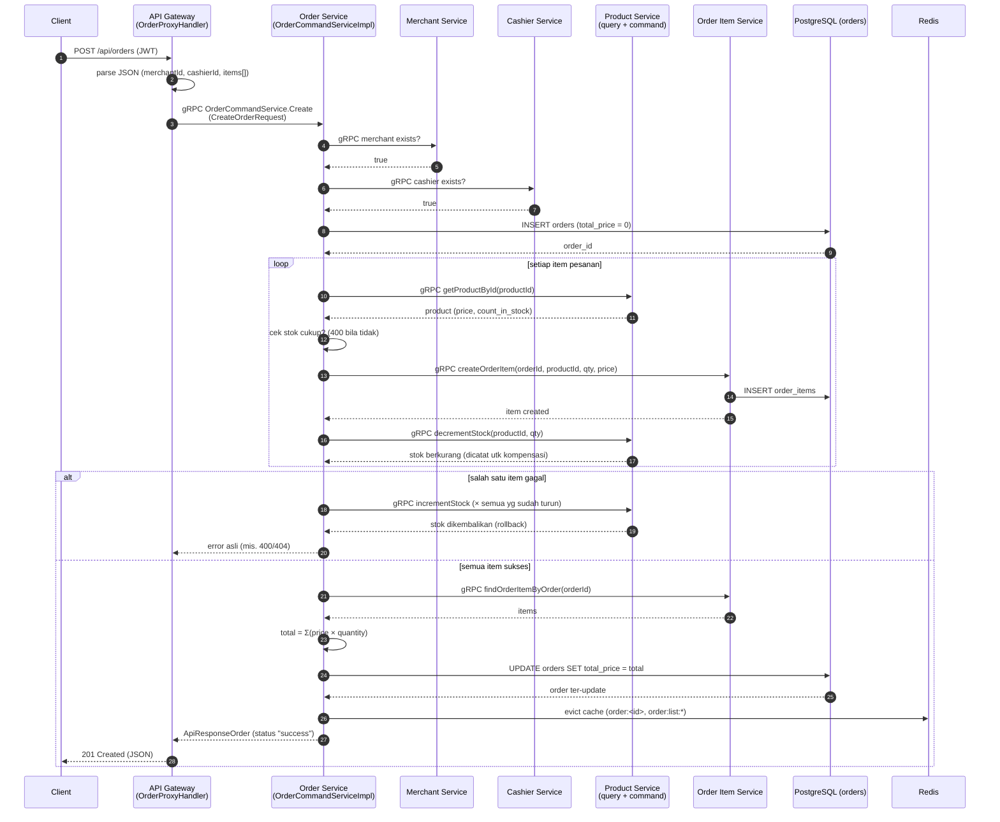

### Diagram sequence — Update Order

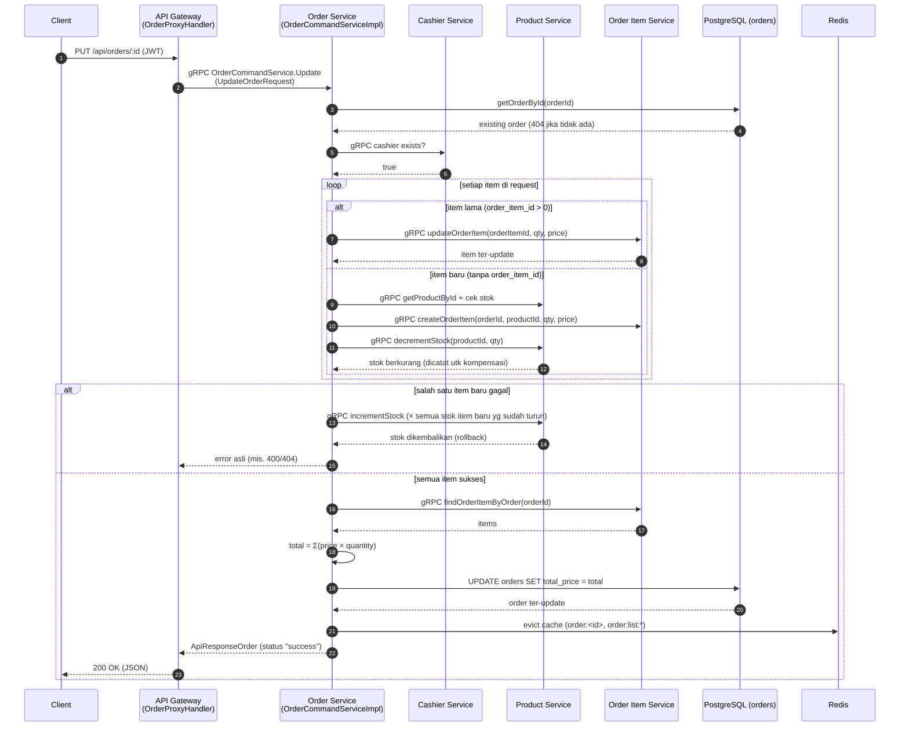

### Diagram sequence — Trash / Restore Order (dengan pengembalian stok)

```mermaid
sequenceDiagram
    autonumber
    participant C as Client
    participant GW as API Gateway<br/>(OrderProxyHandler)
    participant OS as Order Service<br/>(OrderCommandServiceImpl)
    participant PS as Product Service<br/>(command)
    participant OIS as Order Item Service
    participant PG as PostgreSQL (orders)
    participant RD as Redis

    C->>GW: POST /api/orders/trashed/:id (JWT)
    GW->>OS: gRPC TrashedOrder<br/>(FindByIdOrderRequest)

    OS->>PG: findById(orderId) — cek order aktif?<br/>(404 jika tidak ada / sudah trashed)
    PG-->>OS: order aktif

    OS->>OIS: gRPC findOrderItemByOrder(orderId)<br/>(item aktif saja)
    OIS-->>OS: items[]
    loop setiap item aktif
        OS->>PS: gRPC incrementStock(productId, qty)<br/>(stok dikembalikan, dicatat utk revert)
        PS-->>OS: product ter-update
    end

    OS->>PG: UPDATE orders SET deleted_at = NOW()<br/>WHERE order_id = $1 AND deleted_at IS NULL

    alt trash gagal / sudah trashed (race)
        PG-->>OS: null
        OS->>PS: gRPC decrementStock (× semua yg sudah di-restore)<br/>(revert stok)
        OS-->>GW: NotFound 404 "Order not found or already trashed"
    else trash sukses
        PG-->>OS: order ter-trash
        OS->>RD: evict cache (order:<id>, order:list:*)
        OS-->>GW: ApiResponseOrderDeleteAt (status "success")
    end

    GW-->>C: 200 OK (JSON)

    Note over OS: Restore = proses kebalikan:<br/>findByTrashedId → decrement stok item aktif lagi<br/>(simetris) → deleted_at = NULL;<br/>bila restore gagal, stok di-rollback via incrementStock
```

### Diagram sequence — Delete Permanent Order

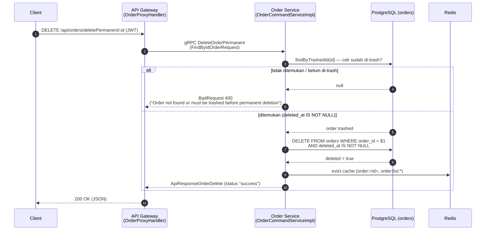

> **Penting:** di implementasi POS ini, `deletePermanent` order **WAJIB
> order sudah di-trash dulu** (berbeda dari versi e-commerce yang mengizinkan
> hapus langsung). Tidak ada cascade delete ke order_items / transactions.

### Diagram sequence — Restore All Orders (dengan pengembalian stok)

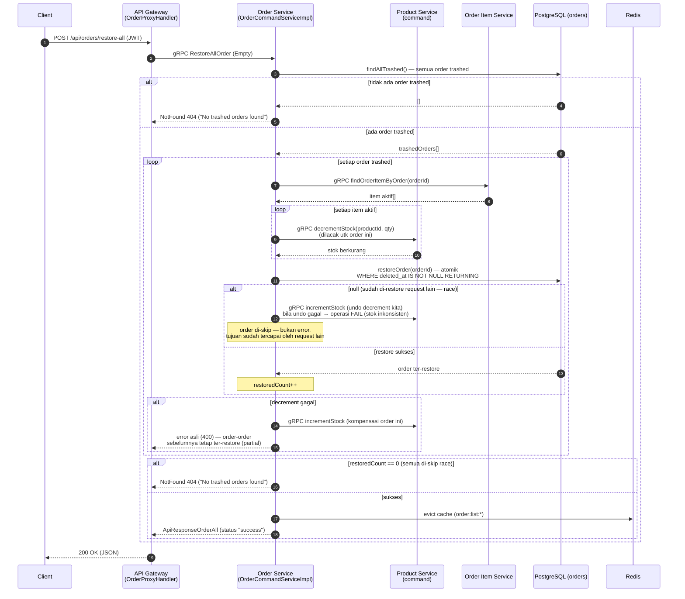

> **Penting:** `restoreAllOrder` kini bekerja **per order** (bukan bulk
> UPDATE), dan `restoreOrder(orderId)` yang atomik (`UPDATE ... WHERE
> deleted_at IS NOT NULL RETURNING`) menjadi titik serialisasi yang menutup
> race double-decrement: pemenang race yang me-restore sekaligus men-decrement
> stok; yang kalah mendapat null → **undo decrement-nya sendiri** lalu skip.
> Bila undo gagal, operasi **fail** (stok inkonsisten) — bukan sukses palsu.
> Partial completion: bila decrement order ke-N gagal, order 1..N-1 yang sudah
> ter-restore tetap ter-restore (stoknya sudah konsisten), error asli
> dipropagasi. Operasi massal `deleteAll` menghapus permanen order yang sudah
> di-trash dan **tidak** menyentuh stok.

---

## 9. Alur Create Transaction (Detail)

`POST /transactions/create` (JWT) → `TransactionProxyHandler.createTransaction`
(membaca `order_id`, `merchant_id`, `payment_method`, `amount`) → gRPC →
`TransactionCommandHandler.create` → `TransactionCommandServiceImpl`:

```text
1. Validasi request (sebelum tracing span — gagal cepat, BadRequest 400)
   - `order_id` wajib > 0  → "order_id is required and must be a positive integer"
   - `payment_method` wajib tidak blank → "payment_method is required"
   - `amount` wajib > 0    → "amount must be a positive integer"
   - (Validasi yang sama berlaku untuk `updateTransaction` +
     `transaction_id` wajib > 0)

2. Insert transaction (SQL langsung)
   - payment_status: diambil dari request bila ada, default "pending"

3. Evict cache list (transaction:list:*)

4. Kirim event email (async, langsung ke Kafka — detail payload di §12.2)
   - merchantQueryRepository.findContactEmailByMerchantId(merchantId)
   - kafkaService.sendMessage("email-service-topic-transaction-create", ...)
   - bila email/kafka tidak tersedia → log warning & lanjut (graceful)

5. Response → TransactionResponse (status "success", HTTP 201)
```

**Ringkasan sifat transaksi:**
- **Tidak idempoten** — tidak ada unique key idempotency; request duplikat
  akan membuat baris baru.
- **Tidak atomik dengan outbox** — event email dikirim langsung ke Kafka
  setelah commit, bukan melalui tabel outbox.
- **Tidak ada debit wallet** — transaksi hanya catatan pembayaran
  (kembalian `change_amount` default 0).

### Diagram sequence — Create Transaction

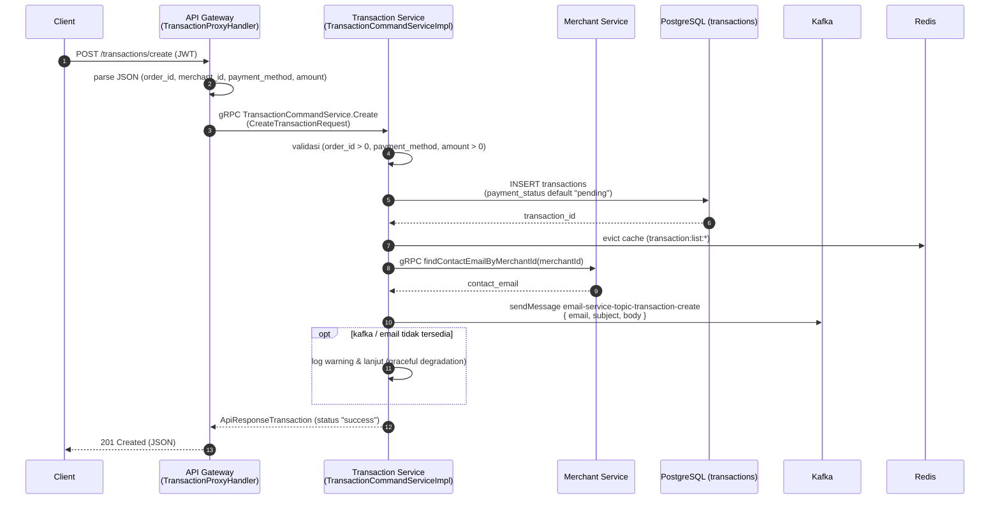

### Diagram sequence — Restore Transaction

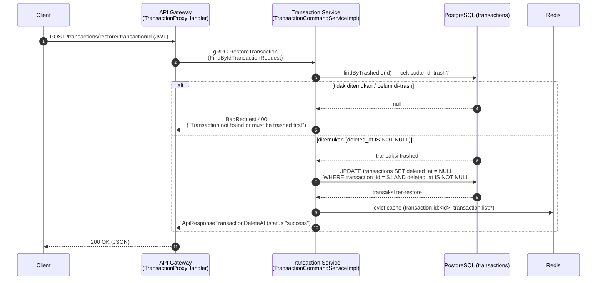

### Diagram sequence — Delete Permanent Transaction

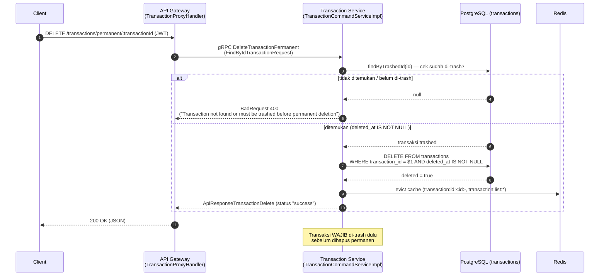

---

## 10. Soft Delete / Trash Pattern

Semua service memakai pola soft delete dengan kolom `deleted_at`:

| Operasi | SQL pattern |
|---|---|
| Trash | `UPDATE ... SET deleted_at = NOW() WHERE deleted_at IS NULL` |
| Restore | `UPDATE ... SET deleted_at = NULL WHERE deleted_at IS NOT NULL` |
| Delete permanen | `DELETE FROM ... WHERE ... AND deleted_at IS NOT NULL` (wajib trashed dulu) |
| Restore all | `UPDATE ... SET deleted_at = NULL WHERE deleted_at IS NOT NULL` |
| Delete all | `DELETE FROM ... WHERE deleted_at IS NOT NULL` |

Aturan bisnis terkait trash:

- **Restore & delete permanent** pada ketiga service mensyaratkan record
  **sudah di-trash** dulu (`findByTrashedId` → `BadRequestException` 400 bila
  tidak).
- **Trash order mengembalikan stok item aktifnya** (kebalikan dari decrement
  saat order dibuat): `trashedOrder` meng-increment stok setiap item aktif
  sebelum soft delete, dan `restoreOrder` men-decrement-nya kembali
  (simetris penuh). Bila trash/restore gagal di tengah, stok di-rollback dan
  error asli tetap dipropagasikan.
- **Trash order tidak ikut me-trash order items** di implementasi POS
  (berbeda dari versi e-commerce yang melakukannya via gRPC). Item yang
  di-trash hanya bila di-trash eksplisit per `order_item_id`.

> **Edge case (interaksi trash order ↔ trash item):** pengembalian stok
> `trashedOrder`/`restoreOrder` hanya memperhitungkan **item aktif**
> (`deleted_at IS NULL`). Jika sebuah item di-trash eksplisit setelah order
> di-trash, lalu order di-restore, stok item tersebut **tidak** di-decrement
> lagi (karena item sudah tidak aktif) — stok bisa bergeser dari posisi
> "aktif = stok terpakai" untuk item tersebut. Perilaku ini disengaja:
> service hanya menyentuh item yang benar-benar aktif.
>
> > **Catatan:** `restoreAllOrder` kini **simetris terhadap stok** — per order:
> > decrement stok item aktif lalu `restoreOrder` atomik (lihat §6.1 & diagram
> > di §8); bila kalah race dengan `restoreOrder` per-record, decrement-nya
> > di-undo sehingga **tidak ada double-decrement**. `deleteAllOrderPermanent`
> > tetap **tidak** menyentuh stok: order dihapus selamanya berarti barang
> > tidak pernah terjual, sehingga stok yang sudah dikembalikan saat trash
> > tetap benar.

### State diagram — Lifecycle Order

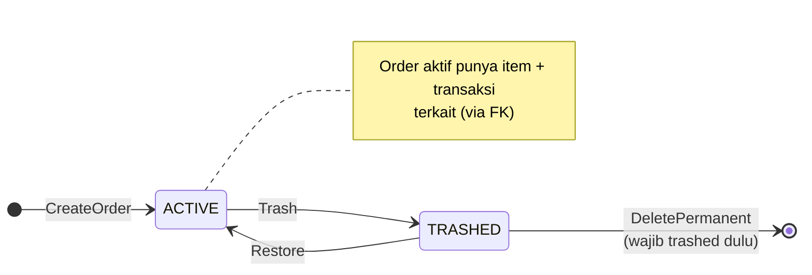

### State diagram — Lifecycle Order Item

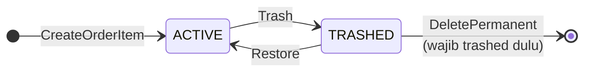

### State diagram — Lifecycle Transaction

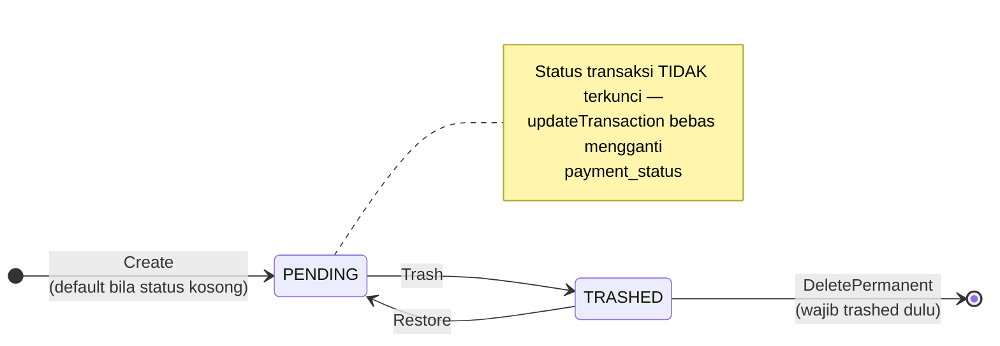

> **Catatan:** berbeda dari versi e-commerce, transaction POS **tidak**
> mengunci status `PAID` — `updateTransaction` dapat mengubah status
> transaksi kapan pun selama belum di-trash.

---

## 11. Caching Redis

Semua service memakai `RedisService` dengan pola **cache-aside**:

```text
Query request
  → GET <key> (Redis)
  → HIT  → return dari cache
  → MISS → query PostgreSQL
          → SET <key> TTL 10 menit
          → return
```

**Order Service** — prefix `order:` (query) & `order:stats:` (stats):
- `order:<id>` (detail)
- `order:list:all:<search>:<page>:<pageSize>`
- `order:list:active:...`, `order:list:trashed:...`
- `order:list:merchant:<merchantId>:<search>:<page>:<pageSize>`
- `order:stats:monthly_total:<year>:<month>`, `order:stats:yearly_total:<year>`
- `order:stats:monthly_order:<year>`, `order:stats:yearly_order:<year>`
- `order:stats:merchant:monthly_total:<merchantId>:<year>:<month>`, dst.

Setiap mutasi memanggil `invalidateCache` / `invalidateListCache` untuk
menghapus `order:<id>` dan semua key `order:list:*` (delete by pattern).

**Transaction Service** — prefix `transaction:`:
- `transaction:id:<id>` (detail)
- `transaction:list:all:<search>:<page>:<pageSize>`
- `transaction:list:active:...`, `transaction:list:trashed:...`
- `transaction:list:merchant:<merchantId>:<search>:<page>:<pageSize>`

**Order Item Service** — prefix `order_item:`:
- `order_item:<id>` (detail, key evict)
- `order_item:order:<orderId>` (daftar item per order)
- `order_item:list:all:<search>:<page>:<pageSize>` (+ varian `active:` / `trashed:`)

> Catatan kecil: `OrderItemQueryServiceImpl` menormalisasi `page` menjadi
> 0-based (`page-1`) **sebelum** membentuk cache key — jadi key list
> memakai offset, bukan halaman 1-based.

---

## 12. Event & Kafka

> **Pemutakhiran:** sebelumnya dokumen ini menyatakan hanya Transaction
> Service yang mempublikasikan event ke Kafka. Sejak penyelarasan terakhir,
> **tiga service** mempublikasikan event (auth, merchant, transaction) ke
> **8 topik** `email-service-topic-*`, dan **email service** adalah satu-satunya
> consumer. Audit lengkap — infrastruktur broker, katalog topik, format
> payload, dedup, chaos, observability, dan operasional — ada di
> [`KAFKA_AUDIT.md`](KAFKA_AUDIT.md). Baca bersama dokumen ini.

### 12.1 Gambaran umum

Semua event bertujuan **notifikasi email asinkron** dan dikirim **langsung**
setelah operasi DB (tanpa transactional outbox). Payload selalu JSON
`{ email, subject, body }`; key/value memakai `StringSerializer`; producer
`acks=1`.

| Topik | Producer | Key | Dipicu saat |
|---|---|---|---|
| `email-service-topic-auth-register` | auth · `RegisterService` | `userId` | register sukses (role di-assign + kode verifikasi di-cache) |
| `email-service-topic-auth-forgot-password` | auth · `PasswordResetService` | `userId` | request reset password (reset token dibuat) |
| `email-service-topic-auth-verify-code-success` | auth · `PasswordResetService` | `userId` | kode verifikasi terpakai (user terverifikasi) |
| `email-service-topic-merchant-create` | merchant · `MerchantCommandService` | `merchantId` | merchant baru dibuat |
| `email-service-topic-merchant-update-status` | merchant · `MerchantCommandService` | `merchantId` | status merchant berubah |
| `email-service-topic-merchant-document-create` | merchant · `MerchantDocumentCommandService` | `documentId` | dokumen merchant dibuat |
| `email-service-topic-merchant-document-update-status` | merchant · `MerchantDocumentCommandService` | `documentId` | status dokumen berubah |
| **`email-service-topic-transaction-create`** | **transaction · `TransactionCommandService`** | `transactionId` | **transaksi baru tercatat** |

### 12.2 Event transaction (fokus dokumen ini)

```text
createTransaction (SQL commit + evict cache transaction:list:*)
   └─ sendTransactionCreateEvent
        ├─ merchantQueryRepository.findContactEmailByMerchantId(merchantId)   [gRPC → merchant]
        ├─ bila contact_email null/blank → warn & skip (tanpa publish)
        └─ kafkaService.sendMessage(
             topic  = "email-service-topic-transaction-create",
             key    = transactionId,
             payload = {
               "email":   <contact_email merchant>,
               "subject": "New Transaction Created",
               "body":    "A new transaction of <b><amount></b> using
                            <b><payment_method></b> has been created.
                            Status: <b><payment_status></b>."
             })
```

Konsumen: **email service** (`email/EmailVerticle`) — satu-satunya consumer;
subscribe ke **8 topik** (termasuk topik auth & merchant) dengan
`group.id=email-service-group`, `auto.offset.reset=earliest`, lalu mengirim
via SMTP (`MailClient` + STARTTLS, `from: no-reply@payment-gateway.com`).
Duplikat replay dicegah **EmailDedupGuard**: Redis key
`email:dedup:<topic>:<partition>:<offset>` TTL 24 jam, dan **fail-open** bila
Redis error (email tetap dikirim).

### 12.3 Sifat pengiriman

- **Graceful degradation:** `KafkaService` null, `contact_email` kosong, atau
  publish gagal → log warning dan request tetap sukses (email bisa hilang —
  trade-off disengaja, tanpa outbox).
- **At-least-once di sisi consumer** (auto-commit offset) → potensi duplikat
  saat replay ditutup oleh dedup Redis di atas.
- Order Service & Order Item Service **tidak** mengirim event Kafka — alurnya
  sinkron via gRPC (create/update/trash/restore order tidak memicu event).

> **Catatan:** versi e-commerce memakai transactional outbox (insert
> `transactions` + `outbox` dalam satu transaksi DB, dipublish oleh
> `OutboxPublisher` periodik). Implementasi POS ini **tidak** memakai pola
> tersebut — event email dikirim langsung setelah insert. Ini berarti jika
> Kafka down, event bisa hilang (trade-off yang disengaja untuk kesederhanaan
> POS, kandidat peningkatan — lihat §14 di `KAFKA_AUDIT.md`).

---

## 13. Error Handling

Pola error berlapis (konsisten dengan `ERROR_HANDLING_SUMMARY.md`):

| Layer | Mekanisme |
|---|---|
| Service | `BadRequestException` (400), `NotFoundException` (404) dari `io.example.common.exception.grpc` |
| gRPC Handler | `.recover(GrpcExceptionMapper::toFailedFuture)` → gRPC StatusException dengan status yang sesuai |
| API Gateway | `GrpcGatewayUtils.handleError(ctx, err)` / `sendError` → JSON response dengan status HTTP yang benar |

Contoh error domain di Order, Order Item, dan Transaction:

- `NotFoundException("Merchant not found")` / `("Cashier not found")` → 404
- `NotFoundException("Order not found")` / `("Product not found")` → 404
- `BadRequestException("Insufficient product stock")` → 400
- `BadRequestException("Order not found or must be trashed first")` → 400
- `BadRequestException("Order item not found or must be trashed before permanent deletion")` → 400
- `BadRequestException("Transaction not found or must be trashed first")` → 400
- `NotFoundException("Transaction not found")` → 404
- `NotFoundException("Order items not found for order id: <id>")` → 404
- `BadRequestException("amount must be a positive integer")` → 400
- `BadRequestException("order_id is required and must be a positive integer")` → 400
- `BadRequestException("payment_method is required")` → 400
- `BadRequestException("transaction_id is required and must be a positive integer")` → 400
- `BadRequestException("Insufficient product stock")` (dari `ProductCommandService.decrementStock`)
  → 400
- `NotFoundException("Product not found")` (dari `incrementStock` bila produk
  hilang/trashed) → 404
- `BadRequestException("Failed to delete order permanently")` /
  `("Failed to delete transaction permanently")` → 400
- `NotFoundException("No trashed orders found")` / `("No trashed products found")` /
  `("No trashed transactions found")` → 404

> **Catatan implementasi:** semua handler membungkus response sukses dengan
> `{ status: "success", message: "OK", data: ... }` dan pagination memakai
> `PaginationMeta { currentPage, pageSize, totalPages, totalRecords }`.

---

## 14. Ringkasan File per Service

### Order Service (`order/`)

```text
src/main/java/io/example/order/
├── OrderVerticle.java                    # entrypoint, gRPC port 50055
├── model/
│   ├── Order.java                        # entity + konversi Row/Json
│   ├── OrderItem.java
│   ├── Product.java                      # DTO hasil query gRPC product
│   └── OrderMonth.java / OrderYear.java / OrderMonthTotalRevenue.java / OrderYearTotalRevenue.java
├── handler/
│   ├── OrderCommandHandler.java          # Create/Update/Trash/Restore/Delete
│   ├── OrderQueryHandler.java            # FindAll/FindById/Active/Trashed + stats
│   └── ProtoConverter.java               # model ↔ protobuf
├── service/
│   ├── OrderCommandService.java / OrderQueryService.java
│   ├── OrderStatsService.java / OrderStatByMerchantService.java
│   └── impl/OrderCommandServiceImpl.java / OrderQueryServiceImpl.java / OrderStatsServiceImpl.java / OrderStatByMerchantServiceImpl.java
├── domain/requests/                      # DTO request domain (CreateOrderRequest, dll.)
└── repository/
    ├── OrderCommandRepository.java / OrderQueryRepository.java
    ├── OrderStatsRepository.java / OrderStatByMerchantRepository.java
    ├── OrderItemCommandRepository.java / OrderItemQueryRepository.java
    ├── CashierQueryRepository.java / MerchantQueryRepository.java
    ├── ProductQueryRepository.java / ProductCommandRepository.java
    └── impl/...  (SQL + adapter gRPC)
```

### Order Item Service (`order_item/`)

```text
src/main/java/io/example/order_item/
├── OrderItemVerticle.java              # entrypoint, gRPC port 50057
├── model/OrderItem.java                # entity + konversi Row/Json
├── handler/
│   ├── OrderItemCommandHandler.java    # Create/Update/Trash/Restore/Delete
│   ├── OrderItemQueryHandler.java      # FindAll/FindByActive/FindByTrashed/FindOrderItemByOrder
│   └── ProtoConverter.java             # model ↔ protobuf
├── service/
│   ├── OrderItemCommandService.java / OrderItemQueryService.java
│   └── impl/OrderItemCommandServiceImpl.java / OrderItemQueryServiceImpl.java
├── domain/requests/                    # DTO request domain
└── repository/
    ├── OrderItemCommandRepository.java / OrderItemQueryRepository.java
    └── impl/...
```

### Transaction Service (`transaction/`)

```text
src/main/java/io/example/transaction/
├── TransactionVerticle.java              # entrypoint, gRPC port 50058, inisialisasi Kafka
├── model/Transaction.java                # entity + konversi
├── enums/PaymentStatus.java
├── handler/
│   ├── TransactionCommandHandler.java    # Create/Update/Trash/Restore/Delete
│   ├── TransactionQueryHandler.java      # FindAll/FindById/FindByActive/FindByTrashed/FindByMerchant
│   ├── TransactionStatsStatusHandler.java
│   ├── TransactionStatsMethodHandler.java
│   └── ProtoConverter.java
├── service/
│   ├── TransactionCommandService.java / TransactionQueryService.java
│   ├── TransactionStatsService.java
│   └── impl/TransactionCommandServiceImpl.java / TransactionQueryServiceImpl.java / TransactionStatsServiceImpl.java
├── domain/requests/                      # DTO request domain
└── repository/
    ├── TransactionCommandRepository.java / TransactionQueryRepository.java
    ├── TransactionStatsRepository.java / MerchantQueryRepository.java
    └── impl/...  (SQL + adapter gRPC merchant)
```

### Product Service (`product/`)

```text
src/main/java/io/example/product/
├── ProductVerticle.java                  # entrypoint, gRPC port 50056
├── model/Product.java                    # entity + konversi (termasuk count_in_stock)
├── handler/
│   ├── ProductCommandHandler.java        # Create/Update/Trash/Restore/Delete + DecrementStock/IncrementStock
│   ├── ProductQueryHandler.java          # FindAll/FindById/Active/Trashed/ByMerchant/ByCategory
│   └── ProtoConverter.java               # model ↔ protobuf
├── service/
│   ├── ProductCommandService.java / ProductQueryService.java
│   └── impl/ProductCommandServiceImpl.java / ProductQueryServiceImpl.java
├── domain/requests/                      # DTO request domain
└── repository/
    ├── ProductCommandRepository.java / ProductQueryRepository.java
    ├── CategoryQueryRepository.java / MerchantQueryRepository.java
    └── impl/...  (SQL + adapter gRPC category/merchant)
```

### API Gateway (`apigateway/`)

```text
src/main/java/io/example/apigateway/
├── ApiGatewayVerticle.java               # konfigurasi router, rate limiter, error handler global
├── handler/OrderProxyHandler.java        # REST /api/orders* → gRPC order
├── handler/OrderItemProxyHandler.java    # REST /api/order-items* → gRPC order_item
├── handler/TransactionProxyHandler.java  # REST /transactions* → gRPC transaction
├── handler/ProductProxyHandler.java      # REST /api/products* → gRPC product
├── routes/GatewayRoutes.java             # registrasi route + middleware JWT
└── utils/GrpcGatewayUtils.java           # helper parse JSON/query, sendResponse, handleError
```

---

## Lampiran — Endpoint Utama

> Semua endpoint di bawah butuh **JWT** (`JwtMiddleware`). Endpoint
> `/users*`, `/roles*` memakai `RoleMiddleware.requireRole("ADMIN")`; order,
> order-item, dan transaction hanya JWT (tidak ada guard role spesifik).

### Product (`/api/products*`)

| Method | Path | Handler |
|---|---|---|
| GET | `/api/products`, `/api/products/active`, `/api/products/trashed` | `findAll` / `findActive` / `findTrashed` |
| GET | `/api/products/:id` | `findById` |
| GET | `/api/products/by-merchant/:merchantId` | `findByMerchant` (filter kategori + harga) |
| GET | `/api/products/by-category/:categoryName` | `findByCategoryName` |
| POST | `/api/products` | `create` (201, **FORM-DATA** — lihat `ProductProxyHandler.create`) |
| PUT | `/api/products/:id` | `update` |
| POST | `/api/products/restore/:id` | `restore` |
| POST | `/api/products/trashed/:id` | `trash` |
| DELETE | `/api/products/deletePermanent/:id` | `deletePermanent` |
| POST | `/api/products/restore-all` | `restoreAll` |
| POST | `/api/products/delete-all` | `deleteAll` |

> RPC `DecrementStock` / `IncrementStock` **tidak** diekspos sebagai endpoint
> REST publik — keduanya dipanggil internal oleh Order Service via gRPC
> (penjualan & kompensasi stok).

### Order (`/api/orders*`)

| Method | Path | Handler |
|---|---|---|
| GET | `/api/orders`, `/api/orders/active`, `/api/orders/trashed` | `findAll` / `findActive` / `findTrashed` |
| GET | `/api/orders/:id` | `findById` |
| GET | `/api/orders/by-merchant/:merchantId` | `findByMerchant` |
| POST | `/api/orders` | `create` (201) |
| PUT | `/api/orders/:id` | `update` |
| POST | `/api/orders/restore/:id` | `restore` |
| POST | `/api/orders/trashed/:id` | `trash` |
| DELETE | `/api/orders/deletePermanent/:id` | `deletePermanent` |
| POST | `/api/orders/restore-all` | `restoreAll` |
| POST | `/api/orders/delete-all` | `deleteAll` |
| GET | `/api/orders/stats/monthly-total-revenue` | stats revenue bulanan |
| GET | `/api/orders/stats/yearly-total-revenue` | stats revenue tahunan |
| GET | `/api/orders/stats/monthly-total-revenue-by-id/:orderId` | stats per order (stub) |
| GET | `/api/orders/stats/yearly-total-revenue-by-id/:orderId` | stats per order (stub) |
| GET | `/api/orders/stats/monthly-total-revenue-by-merchant/:merchantId` | stats per merchant |
| GET | `/api/orders/stats/yearly-total-revenue-by-merchant/:merchantId` | stats per merchant |
| GET | `/api/orders/stats/monthly-revenue` / `yearly-revenue` | statistik order bulanan/tahunan |
| GET | `/api/orders/stats/monthly-revenue-by-merchant/:merchantId` / `yearly-revenue-by-merchant/:merchantId` | statistik per merchant |

### Order Item (`/api/order-items*`)

| Method | Path | Handler |
|---|---|---|
| GET | `/api/order-items`, `/api/order-items/active`, `/api/order-items/trashed` | `findAll` / `findActive` / `findTrashed` |
| GET | `/api/order-items/by-order/:orderId` | `findByOrder` |

> Operasi tulis (create/update/trash/delete) order item dilakukan **internal**
> oleh Order Service via gRPC; gateway hanya menyediakan endpoint query.

### Transaction (`/transactions*`)

| Method | Path | Handler |
|---|---|---|
| GET | `/transactions`, `/transactions/active`, `/transactions/trashed` | `getTransactions` / `getActiveTransactions` / `getTrashedTransactions` |
| GET | `/transactions/:transactionId` | `getTransactionById` |
| POST | `/transactions/create` | `createTransaction` (201) |
| POST | `/transactions/update` | `updateTransaction` |
| POST | `/transactions/trash/:transactionId` | `trashTransaction` |
| POST | `/transactions/restore/:transactionId` | `restoreTransaction` |
| DELETE | `/transactions/permanent/:transactionId` | `deleteTransactionPermanently` |
| POST | `/transactions/restore-all` | `restoreAllTransactions` |
| DELETE | `/transactions/permanent-all` | `deleteAllPermanentTransactions` |
| GET | `/transactions/monthly-success` / `yearly-success` / `monthly-failed` / `yearly-failed` | stats status |
| GET | `/transactions/monthly-methods` / `yearly-methods` | stats metode pembayaran |
| GET | `/transactions/monthly-success-by-merchant/:merchantId` dst. | stats status per merchant |
| GET | `/transactions/monthly-methods-by-merchant/:merchantId` dst. | stats metode per merchant |

> Catatan: tidak ada endpoint `/transactions/order/:orderId` maupun
> `/transactions/merchant/:merchantId` di gateway POS (query `getTransactionByOrderId`
> ada di repository tapi tidak diekspos lewat gateway/proto).

---

## Kesimpulan

- **Order Service** adalah service komposisi: ia mengorkestrasi gRPC ke
  cashier, merchant, product (stok), dan order-item — membuat order dengan
  snapshot harga produk, menurunkan stok, lalu menghitung ulang `total_price`.
  Di POS, order diikat ke **cashier**, bukan user.
- **Product Service** kini menjadi komponen stok krusial: RPC
  `DecrementStock` / `IncrementStock` menurunkan/mengembalikan `count_in_stock`
  secara **atomik di SQL** (`AND count_in_stock >= $2`), sehingga stok tidak
  pernah negatif walau ada race. Order Service mengandalkan guard ini sebagai
  lapisan keamanan kedua setelah cek query.
- **Order Item Service** melayani CRUD item pesanan dan query per order —
  dipanggil Order Service untuk membuat/meng-update item dan menghitung total.
- **Transaction Service** adalah catatan pembayaran sederhana: validasi
  eksplisit (`order_id`/`payment_method`/`amount`), insert langsung, dan
  notifikasi email via Kafka. **Tidak** ada idempotency, outbox, wallet,
  maupun perhitungan ulang amount server-side.
- Keempat service memakai pola CQRS + cache-aside Redis + soft delete +
  OpenTelemetry tracing, dan diakses lewat API Gateway HTTP/JSON yang
  meneruskan ke gRPC.
